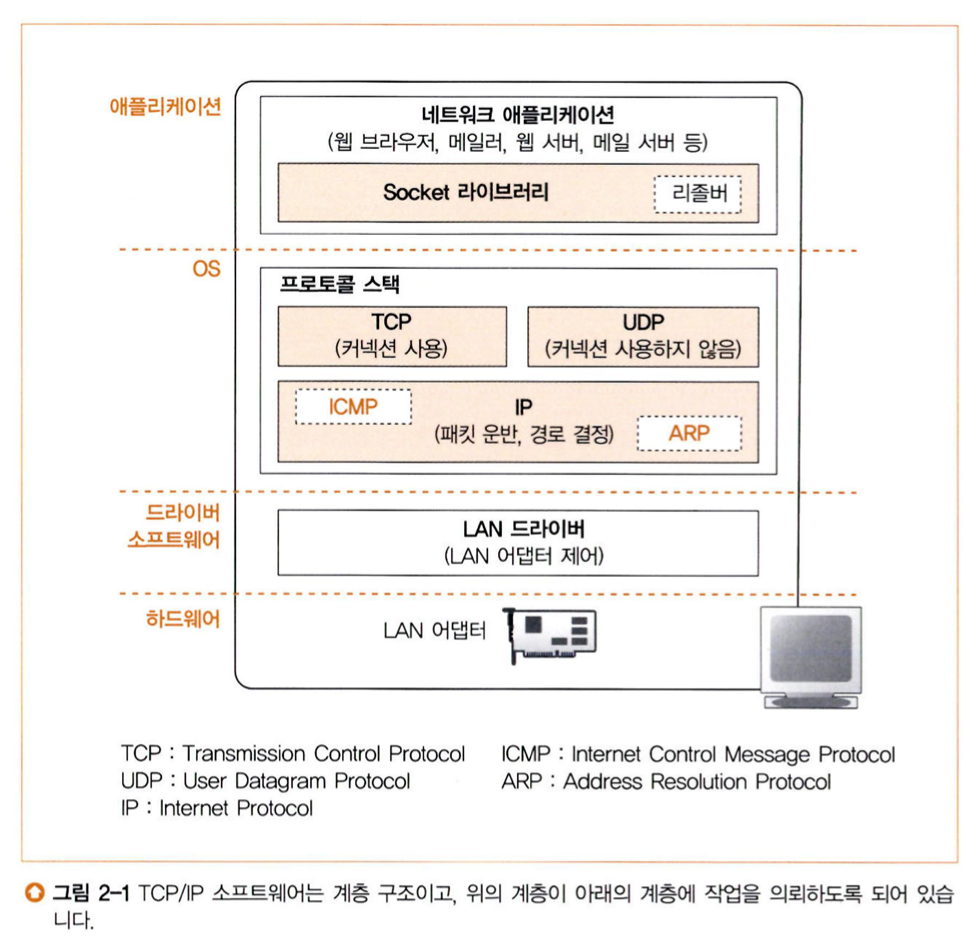
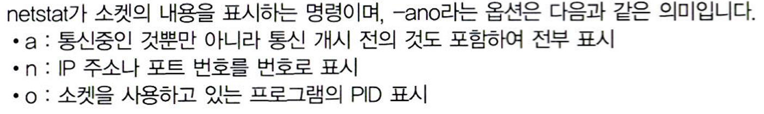

# story1: TCP/IP의 데이터를 전기 신호로 만들어 보낸다

## 프로토콜 스택과 lan 어댑터의 탐험
:이 장에서는 os에 내장된 프로토콜 스택이 어떻게 송신을 의뢰하는지에 관해 설명한다.

## story1. 소켓을 작성한다

애플리케이션의 의뢰를 받은 프로토콜 스택이 tcp 프로토콜을 이용하여 메시지를 송신한다.

1. 프로토콜 스택의 내부 구성
    - os에 내장된 네트워크 제어용 소프트웨어(프로토콜 스택)와 네트워크용 하드웨어(lan 어댑터)가 브라우저에서 받은 메시지를 서버에 송출하는 동작 설명한다
    - 프로토콜 스택의 내부
      
      - 네트워크 애플리케이션이 데이터 송수신의 일을 의뢰
      - 프로토콜 스택 윗부분 : TCP 또는 UDP 프로토콜 사용해 데이터 송수신 담당 = 애플리케이션에서 보낸 의뢰를 받아 송수신 동작을 실행한다.
          - TCP : 브라우저, 메일 등 일반적인 애플리케이션의 데이터 송수신에 사용
          - UDP : DNS서버에 대한 조회 등 짧은 제어용 데이터 송수신에 사용
      - 프로토콜 스택 아래부분:  IP 프로토콜을 사용해 패킷 송 수신 동작을 제어
          - IP의 주 역할 : 패킷을 통신상대까지 운반하는 것
          - 패킷 : 분할된 데이터 덩어리
          - ICMP : 패킷을 운반할 때 발생하는 오류를 통지하거나 제어용 메시지를 통지할 때 사용
          - ARP :  IP주소에 대응하는 이더넷의 MAC주소를 조사할 때 사용
      - LAN드라이버 : LAN 어댑터 하드웨어를 제어
      - LAN 어댑터 : 실제 케이블에 대해 신호를 송 수신함

2. 소켓의 실체는 통신 제어용 제어 정보
    - 프로토콜 스택은 **내부에 통신 동작을 제어하기 위해**, **제어 정보를 기록하는 메모리 영역을 가짐**
        - 통신 상대의 IP주소는 무엇인가, 포트번호, 통신 동작이 어떤 진행 상태에 있는가
        - **이 제어 정보가 소켓의 실체** (소켓은 개념적인 것, **제어 정보를 기록한 메모리 영역** = 소켓)
    - 프로토콜 스택은 이 제어 정보를 참조하며 동작한다.

      예) 데이터 송신 시, 소켓에 기록된 ip주소, 포트번호를 보고 송신. ⇒ 응답이 돌아오지 않으면, 데이터를 다시보내야하는데
      ⇒ **소켓에 응답이 돌아오는지 여부와 송신동작 후 경과시간이 기록됨**
      = 소켓에 기록된 제어정보를 참조하며 프로토콜 스택이 동작함.

    - 소켓에 기록된 제어 정보 살펴보기

      netstat 명령어

      

        - 소켓의 내용 : 프로토콜 종류 / 로컬의 ip와 포트번호 /통신 상대측의 ip와 포트번호 / 통신상태(State) : Listening(상대 접속을 기다리는 상태), Established(접속 동작이 끝나고 데이터가 통신 중) / pid( Process ID :소켓을 사용하는 프로그램의 식별번호)
    - 소켓을 만드는 것 = 제어정보를 추가하고, 송 수신 데이터를 일시적으로 저장하는 버퍼메모리를 준비하는 등 통신을 준비하는 작업

1. 소켓을 호출했을 때의 동작

   : 브라우저가 소켓 라이브러리 프로그램 부품을 호출 했을 때, 프로토콜 스택 내부는 어떻게 움직이는가?

    1. 소켓 생성 : 프토토콜 스택은 소켓 1개 분량의 메모리 영역을 확보한다 → 송수신이 시작되지 않은 초기 상태를 나타내는 제정보를 기록한다
    2. 디스크립터를 애플리케이션에 알린다. (소켓 식별 정보)
    3. 애플리케이션은 프로토콜에 데이터 송수신 의뢰할 때, 디스크립터를 통지한다.
       : 디스크립터로 프로토콜 스택(필요한 정보 모두 있음)에서 필요한 정보 꺼내오면 된다
