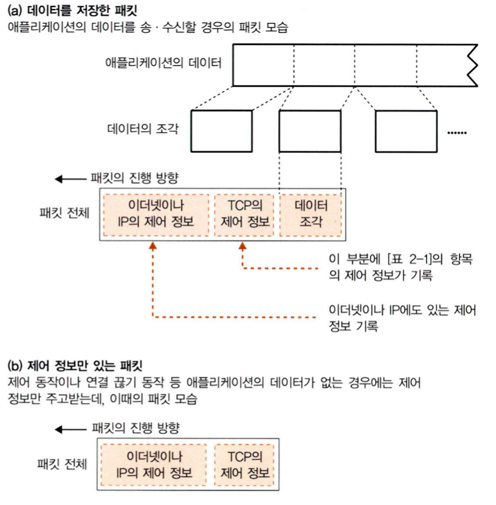
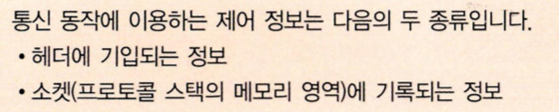

# story2. 서버에 접속한다

클라이언트측의 소켓을 서버측의 소켓에 접속하는 단계.

접속한다는 것이 구체적으로 어떤 것인지, 이때 프로토콜 스택이 어떻게 움직이고, 서버와 어떻게 연결하는지 설명한다.

1. 접속의 의미
    - 클라이언트 측,
        - 소켓 작성 이후 → connect 호출 : 프로토콜 스택이 자기쪽의 소켓을 서버측 소켓에 접속
        - 서버에 접속한다 = 통신 상대와의 사이에서 **제어 정보를 주고받아** 소켓에 필요한 정보를 기록하고 데이터 송수신이 가능한 상태로 만드는 것
        - 이더넷, 통신회선 등의 케이블은 항상 접속된 상태에 있으므로 언제든 신호 보낼 수 있음
        - 소켓을 만든 직후, 아무것도 기록되지 않으므로 통신상대가 누구인지 모름.
          → **서버의 ip주소나 포트번호를 프로토콜 스택에 알리는 동작이 필요함**
    - 서버 측,
        - 클라이언트에서 정보(자신의 Ip주소 포트번호 등)를 알려서, **서버측의 프로토콜 스택이 클라이언트 정보를 가지도록 해야함**
    - 접속 동작
        1. 통신 상대와의 사이에서 제어 정보 주고받고 소켓에 기록하기

           → 데이터 송 수신이 가능한 상태가 됨

        2. 송 수신 데이터를 일시적으로 저장하는 메모리(버퍼 메모리) 영역 확보하기

    2. 맨 앞부분에 제어 정보를 기록한 헤더를 배치한다
        - **헤더의 형태로 제어 정보를 주고 받는다**
          

        - **제어정보 : 소켓에 기록되어, 프로토콜 스택의 동작을 제어**
          (애플리케이션에서 통지된 정보, 통신 상대로부터 받은 정보, 송수신 진행 상황 등이 기록)
        - 프로토콜 스택이 어떤 제어 정보를 필요로 하는지는 프로토콜 스택을 만든 OS에 따라 다르다
        - 소켓에 기록한 제어정보는 상대측에서 볼 수 없다

          : 규칙에 따라 헤더에 제어정보를 기록해 대화하면 되기 때문. 어차피 봐도 서로 프로토콜 스택 내부구조가 달라 각 프로토콜 스택이 필요한 제어 정보도 다름

          

    - 예) TCP 헤더 : 서버와 클라이언트가 대화할 때마다(접속, 송 수신, 연결 끊기 시) 패킷의 맨 앞부분에 제어 정보를 부가한다

3. 접속 동작의 실체
    - 소켓 라이브러리의 connect를 호출하는 것

      

      ⇒ ip주소 포트번호 쓰면, 프로토콜 스택의 tcp 담당부분에 전달된다.

      ⇒ tcp 담당부분은- 서버의 tcp 담당 부분과 제어 정보를 주고 받는다.

    - 접속과정
        1. **TCP  담당부분은 데이터 송 수신 동작의 개시(접속)를 나타내는 제어정보를 기록한 TCP 헤더 만듦 +  SYN이라는 컨트롤 비트 1로 만듦**

           : TCP헤더의 송신처(클라이언트측의 소켓)와 수신처의 포트번호로 접속하는 소켓을 지정
           (**포트번호를 통해 접속해야하는 클/서의 소켓 지정**)

        2. TCP 헤더만든 후, IP담당부분에 건네주어 송신하도록 의뢰.
        3. IP 담당 부분이 패킷 송신 동작을 실행
        4. 네트워크를 통해 패킷이 서버에 도착
        5. 서버의 IP담당부분이 TCP 담당 부분에 패킷 건네줌
        6. 서버측의 TCP 담당 부분이, **헤더에 기록된 수신처 포트번호에 해당하는 소켓을 찾아낸다**
        7. 서버의 해당 소켓이 발견되면, **이 소켓에 필요한 정보를 기록하고, 접속 동작이 진행중인 상태가 된다**
        8. 서버의 **TCP** 담당부분은 응답을 돌려보낸다
            - TCP헤더 만들고 ACK라는 컨트롤 비트 1로 만듦

              : 패킷 받은 것 알리기 위한 동작

            - TCP헤더를 IP 담당부분에 건네주어 클라이언트에 반송
            - 패킷이 클라이언트의 TCP 담당부분에 도착,
            - 이때 TCP헤더 조사해, 서버측의 접속 동작이 성곡했는지 확인
              : SYN이 1이면 접속 성공
              - 접속 성공시, 클라이언트의 **소켓에 서버의 ip주소나 포트번호 등과 함께 소켓에 접속 완료를 나타내는 제어 정보를 기록**
              - 이전에 서버가 보낸 ack 비트와 함께 패킷이 도착한 것을 서버에 알리기위해,ack 비트를 1로 만든 tcp 헤더를 반송
              - 이것이 서버에 도착하면 접속 동작의 대화가 끝난다

      ⇒ 이 과정을 통해 소켓이 연결되었다. (커넥션 : close 호출하여 연결을 끊을 때까지 계속 존재
