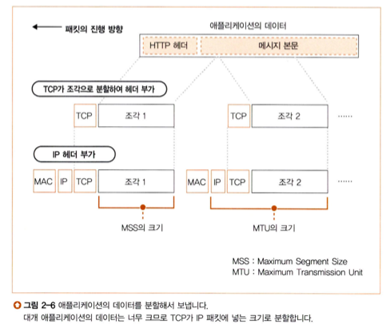
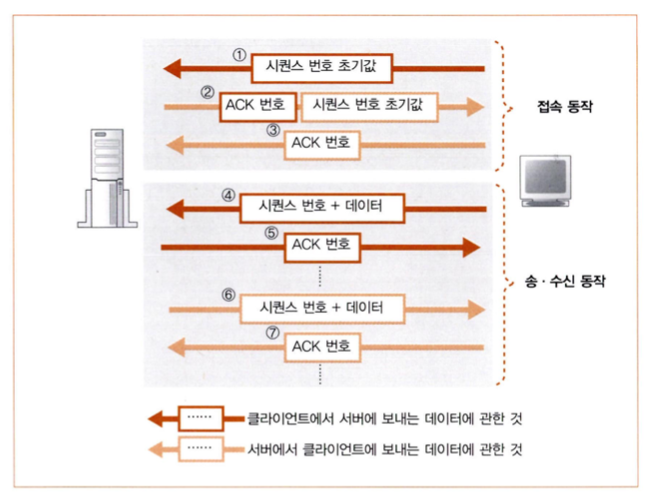

# story 3. 데이터를 송수신한다
- 소켓이 연결되어 메시지를 송신하는 단계.
- 프로토콜 스택은 애플리케이션에서 의뢰받은 메시지를 작은 조각으로 분할해 서버를 향해 송신한다.

## 1. 프로토콜 스택에 HTTP 리퀘스트 메시지를 넘긴다

### 송수신 동작 과정
1. 애플리케이션이 `write(...)`을 호출하며 프로토콜 스택에 송신 데이터를 전달
2. 프로토콜 스택이 송신 동작을 실행

### 프로토콜 스택은 어떤 기준으로 데이터를 저장하고 송신할까?
- 프로토콜 스택은 받은 데이터를 일단 내부 송신용 버퍼 메모리 영역에 저장하고, 애플리케이션이 다음 데이터를 주기를 기다린다.
- 이 때, 데이터의 길이는 애플리케이션의 종류나 만드는 방법에 따라 결정된다.
- 즉 한 번의 송신 의뢰에서 건네주는 데이터의 길이는 프로토콜 스택에서 제어할 수 없다.

- 프로토콜 스택이 데이터를 저장하고 송신하는 판단 요소로는 두 가지가 있다.

1. 한 패킷에 저장할 수 있는 데이터의 크기
     - MTU를 매개변수로 받아 판단한다.
     - MTU : 패킷 한 개로 운반할 수 있는 디지털 데이터의 최대 길이
     - MSS : 헤더를 제외하고 한 개의 패킷으로 운반할 수 있는 TCP의 데이터의 최대 길이

2. 타이밍
     - 애플리케이션의 송신 속도가 느려지는 경우, 최대로 데이터를 저장하려면 시간이 오래 걸린다. -> 송신 동작 지연
     - 따라서 프로토콜 스택은 내부에 타이머를 두고, 일정 시간 이상 경과하면 데이터가 최대로 모이지 않아도 패킷을 송신한다.

- 두 판단 기준은 서로 다른 점을 중시한다.
  - `네트워크 이용 효율 <-> 송신 동작 지연 방지`
- 어떻게 판단할지는 프로토콜 스택을 만드는 개발자에게 맡겨져 있으므로, OS 종류나 버전에 따라 동작이 달라진다.
- 또, 애플리케이션 측에서도 송신의 타이밍을 제어하는 여지를 남겨두었다.
  - 데이터 송신을 의뢰할 때 '버퍼에 머물지 않고 바로 송신할 것'으로 옵션을 지정할 수 있다.

## 2. 데이터가 클 때는 분할하여 보낸다
- 송신 버퍼에 저장된 데이터가 MSS를 초과하는 경우 이를 분할한다.
- 맨 앞부터 차례대로 MSS에 맞게 분할하고, 분할한 조각을 한 개씩 패킷에 넣어 송신한다.
- 이 때 TCP 헤더를 부가하고, 소켓에 기록된 제어 정보를 바탕으로 필요한 항목을 기록한다.

## 3. ACK 번호를 사용하여 패킷이 도착했는지 확인한다
### 송신 후 확인 동작
- TCP에는 송신한 패킷이 상대에게 올바르게 도착했는지 확인하고, 도착하지 않았으면 다시 송신하는 기능이 있다.

- 시퀀스 번호와 ACK 번호로 패킷의 도착을 확인한다.
  - 시퀀스 번호: 데이터를 분할할 때, 분할한 각 조각이 통신 개시부터 따져서 몇 번째 바이트에 해당하는지 세어둔 값을 TCP 헤더에 기록한 것
  - ACK 번호: 이전에 수신한 데이터의 바이트 값을 합쳐서 몇 번째 바이트까지 수신한 것인지 계산하여 헤더에 기록한 것
    - 패킷의 누락이 없는 것을 확인할 수 있다.
    - **수신 측에서** ACK 번호를 **되돌려주는 동작**으로 'xx번째 바이트까지 수신했다'고 응답하는 것을 **수신 확인 응답**이라고 부른다.

> 실제로는 시퀀스 번호가 1부터 시작하지 않고, 난수를 바탕으로 산출한 초기값으로 시작한다.
> 이 때 초기값을 통지하는 SYN의 제어 비트를 1로 하여 보낸다. (시퀀스 번호와는 다른 것임)

### 동작 순서

- 접속 동작
  1. `클라이언트`에서 서버에 보내는 데이터의 시퀀스 번호의 초기값을 산출해 `서버`에 통지
  2. `서버`에서 초기값으로부터 ACK 번호, 시퀀스 번호의 초기값을 산출해 `클라이언트`에 통지  
- 송수신 동작
  1. `클라이언트`에서 초기값으로부터 ACK 번호를 산출해 `서버`에 반송
  2. `클라이언트`에서 `서버`로 데이터와 함께 시퀀스 번호 보냄
  3. `서버`에서 ACK 번호 반송  
  (6~7. 서버에서 클라이언트에 데이터를 보내는 경우 위와 반대)

## 4. 패킷 평균 왕복 시간으로 ACK 번호의 대기 시간을 조정한다
- 타임아웃 값 : ACK 번호가 돌아오는 것을 기다리는 대기 시간
- 네트워크 혼잡으로 이 동작이 지연되는 경우가 있는데, **소모적인 다시 보내기를 방지**하기 위하여 대기 시간을 적절히 길게 설정해야 한다. 
> 패킷을 다시 보내는 것이 오히려 혼잡을 악화시킬 수도 있다. 물론 대기 시간이 너무 길어져도 속도 저하의 원인이 된다.
- TCP는 타임 아웃 값을 동적으로 변경하는 방법을 사용한다.
  - 데이터 송신 동작 시 항상 ACK 번호가 돌아오는 시간을 계측
  - ACK 번호가 돌아오는 시간이 지연/짧아짐에 따라, 대기 시간도 그만큼 바꿔 설정한다.

## 5. 윈도우 제어 방식으로 효율적으로 ACK 번호를 관리한다
  ACK 번호를 기다리는 시간의 낭비를 없애기 위해, TCP는 윈도우 제어 방식을 사용한다.
  
### 윈도우 제어 방식
- ACK 번호를 기다리는 사이에 다음 송신을 하는 방식
- 수신 측에서는 수신 버퍼에 데이터를 받음
  - 수신 확인 응답을 위한 처리가 끝나지 않은 상태에서 다음 패킷이 도착해도, 이를 일시 보관할 수 있도록 하기 위함
- 수신 측에서는 송신 측에 수신 가능한 데이터 양을 통지함, 송신 측은 통지받은 양을 초과하지 않도록 함
  - 버퍼가 넘치는 것을 방지하기 위함
- `윈도우 필드` : 수신 가능한 데이터 양을 송신 측에 알리는 TCP 헤더
- `윈도우 사이즈` : 수신 가능한 데이터 양의 최대 값

## 6. ACK 번호와 윈도우를 합승한다

윈도우 통지와 ACK 번호 통지 타이밍은 아래와 같이 다르다.
### 윈도우 통지의 타이밍
- 수신 측에서 버퍼에서 데이터를 추출할 때
- 윈도우 값은 송신 측에서 데이터를 송신할 때마다 직접 산출할 수 있기 때문에 매번 보낼 필요가 없다.

### ACK 번호 통지의 타이밍
- 정상 수신을 확인할 수 있을 때, 데이터를 수신한 후 즉시

하지만 두 종류의 통지에 대한 패킷을 따로 따로 보내면, 송신측에 보내는 패킷이 많아져 효율성이 저하된다.

### ACK 번호와 윈도우를 한 개의 패킷에 합승
따라서 이 둘을 한 개의 패킷에 합승시켜 통지한다.
- ACK 번호 또는 윈도우를 통지할 때, 소켓을 바로 보내지 않고 잠시 대기한다.
- 기다리는 동안 다음 통지 동작이 일어나면, 이를 한 개의 패킷으로 묶어서 보낸다.
  
> 여러 번의 ACK 번호 통지 또는 윈도우 통지가 연속해서 일어난 경우에도 최후의 것만 통지하는 방식으로 보내는 패킷의 수를 줄인다.

## 7. HTTP 응답 메시지를 수신한다
위의 설명은 프로토콜 스택이 **HTTP 리퀘스트** 메시지를 **보내는** 동작에 대한 것에 대해서만 다루고 있다.  

브라우저의 리퀘스트 메시지 송신 의뢰가 끝나면,  
1. 서버에서 돌아오는 응답 메시지를 받기 위해 `read` 프로그램을 호출
2. 프로토콜 스택은 서버에서 응답 메시지의 패킷이 도착할 떄까지 대기
3. 패킷이 도착하면, 수신 버퍼에서 수신 데이터를 추출
4. 추출한 데이터를 애플리케이션에 전달

이 때, 프로토콜이 데이터를 수신하는 동작은 앞서 설명한 데이터 송신 부분과 내용이 같다.
1. 데이터 누락 여부 검사(패킷과 TCP 헤더 내용 조사)
2. 문제가 없으면 ACK 번호 반송
3. 패킷을 수신 버퍼에 일시 보관, 패킷들을 연결하여 데이터 복원 후 애플리케이션에 전달
4. 타이밍을 가늠하여 윈도우를 송신 측에 통지

> - "데이터를 애플리케이션에 전달한다"는 말은, 수신 데이터를 애플리케이션이 지정한 메모리 영역에 옮겨 기록한 후, 애플리케이션에 제어를 되돌려 준다는 뜻이다.  
> - "타이밍을 가늠한다"는 말은, ACK 번호 등 합승할 수 있는 정보가 있다면 이를 합승시켜 패킷을 보낸다는 뜻이다.