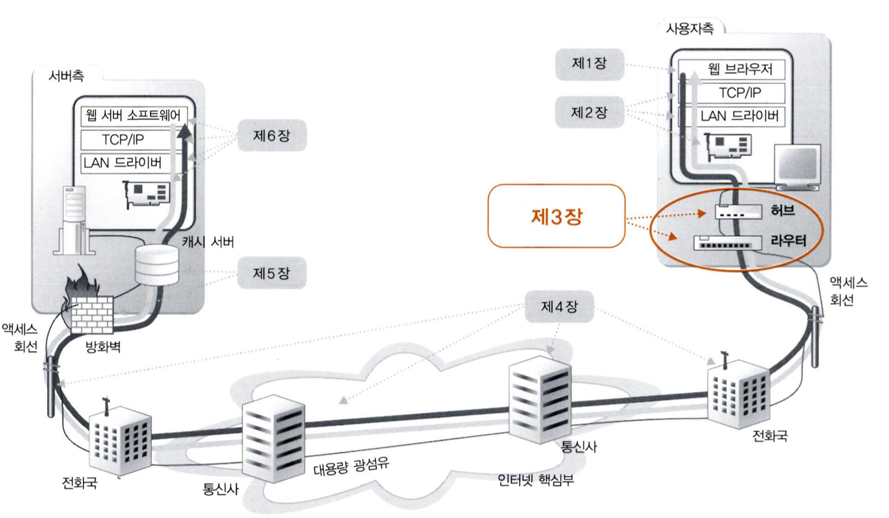
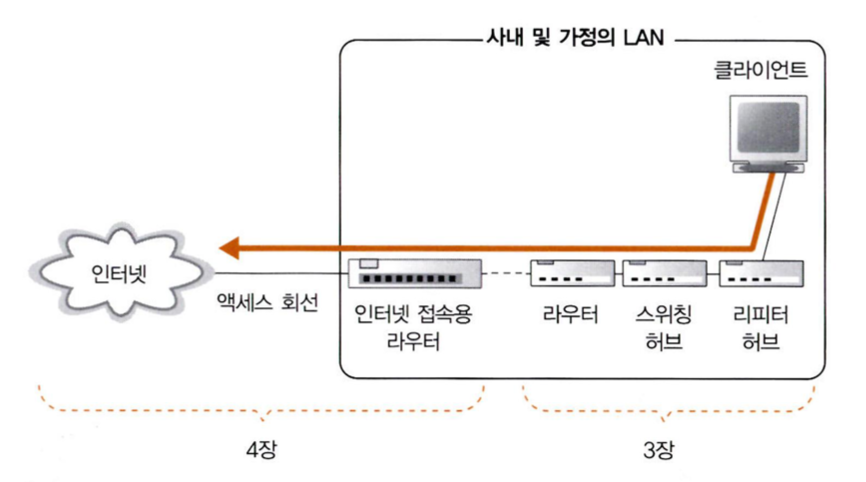
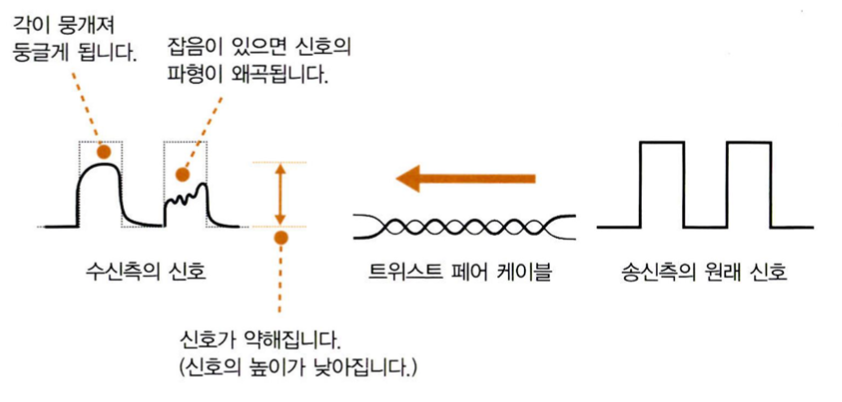
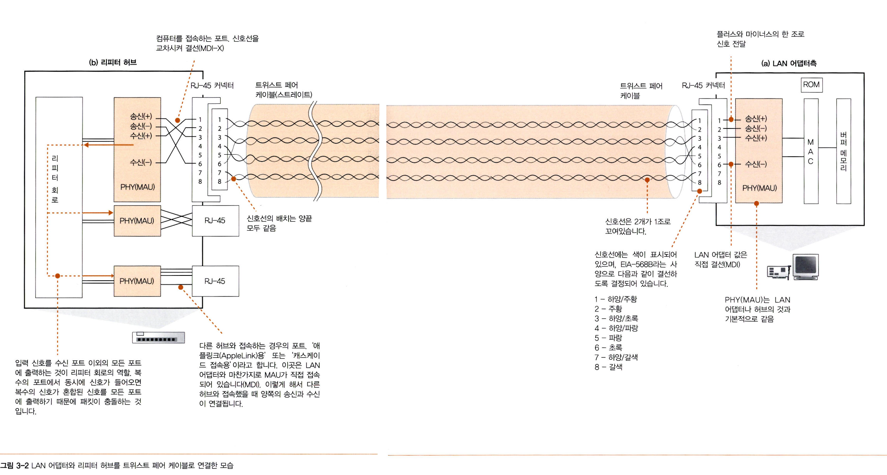
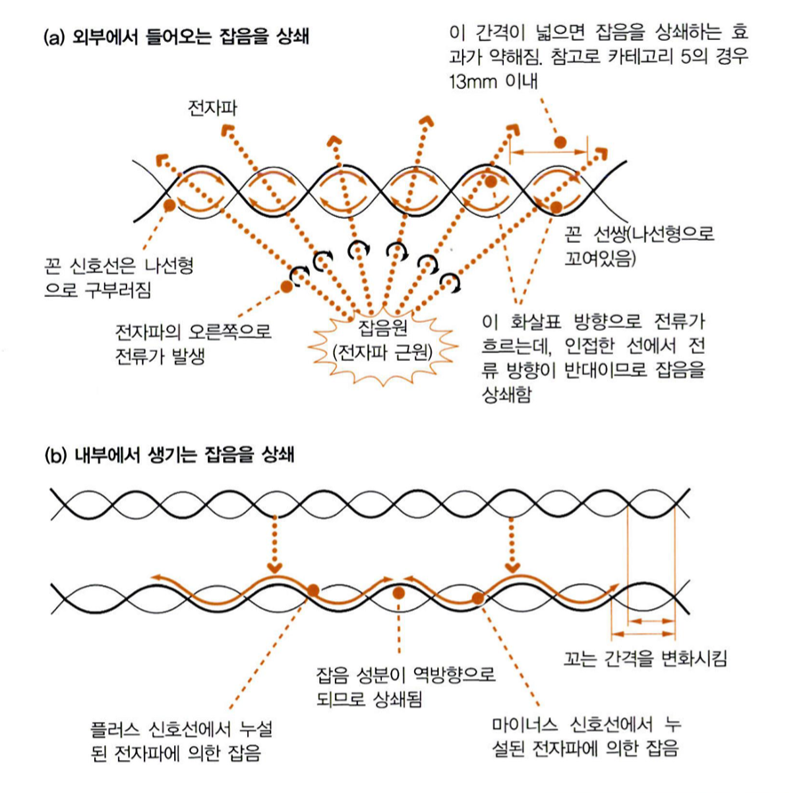
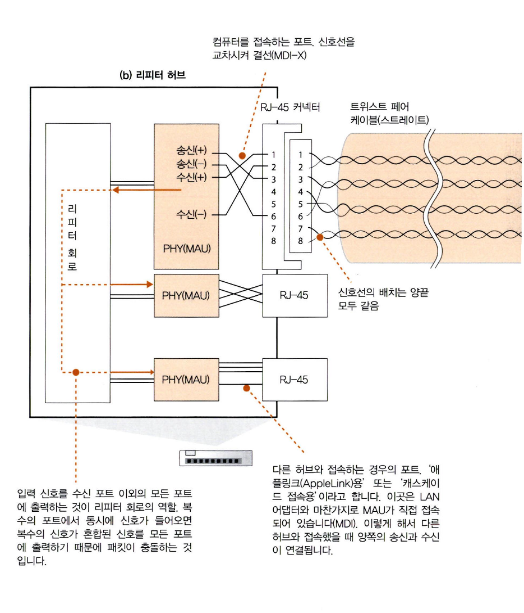
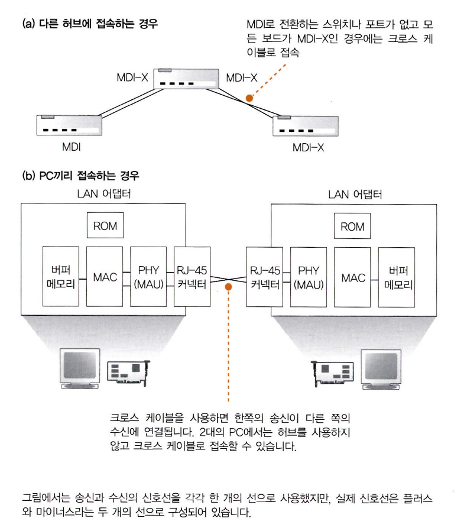

# 3단원. 케이블 앞은 LAN기기였다.
## 허브와 스위치, 라우터의 탐험

케이블에 송출한 패킷이 - 리피터 허브 - 스위칭 허브 - 라우터 등의 네트워크 기기를 경유하여 인터넷을 향해 진행하는 부분을 탐험한다.

- 컴퓨터에서나온 신호는 케이블을 통해 리피터 허브등을 경유한다.

# story1 : 케이블과 리피터, 허브 속을 신호가 흘러간다

1. 하나 하나의 패킷이 독립적으로 동작한다
    - 송신된 패킷은 허브나 라우터라는 중계 장치에 의해 중계되어 목적지를 향해 진행한다.
    - 패킷의 **헤더에 기록된 제어정보와 중계장치 내부에 있는 중계 대상을 등록한 표로 목적지를 판단**하고 목적지에 가까워지도록 패킷을 중계한다.
    - **중계장치는 데이터 부분을 보지 않고 패킷을 중계**한다. 즉, 데이터나 tcp 프로토콜의 제어정보(tcp헤더) 는 패킷 운반 동작에 영향을 주지 않는다 (예: http 메시지, tcp 수신확인, 시퀀스 번호 등)
    - 가정에서는 **리피터 허브나 스위칭허브가 내장된 라우터를 사용하는 경우가 많고**, 단일 기능의 여러 개 기기를 연결해 사용하는 경우가 적다.

    ---

   but 단일 기능의 기기가 이해하기 쉬우므로, 단일 기능의 여러 기기를 연결해서 사용하는 것으로 설명한다

2. **lan케이블은 신호를 약화시키지 않는 것이 핵심이다**

   lan어댑터에서 패킷이 송신되어 케이블로 나간다.

   l**an어댑터의 PHY(MAU)회로**에서 **전기 신호로 형태를 바꾼 패킷**은 → **RJ-45 커넥터**를 통해 **트위스트 페어 케이블(꼰 선쌍)에** 들어간다. (1번과 2번 핀에서 케이블로 신호 흐름)

   → 리피터 허브의 커넥터 부분에 도착(전기신호가 케이블을 통해 전달된다)

    - PHY(MAU) : 이더넷에는 다수의 파생 방식이 있는데, 파생 방식에 따라 신호 송수신 회로의 호칭이 다르다. (100메가비트/초 이상의 이더넷은 Physical Layer Device라고 부른다= 고속방식)

    - **송출한 신호는 그대로의 모습으로 허브에 도착하는 것이 아니라, 허브에 도착할 때는 신호가 약해져 있다**, 케이블을 통과하는 사이에 신호의 에너지가 조금씩 떨어지기 때문이다.

      → 케이블 길이가 길 수록 신호가 약해진다

    

    

     - 신호는 단지 약해지는 것이 아니라, 사각형의 각진 신호가 뭉개져 둥글게 된다.
        
        신호의 각진 부분 = 전압이 급격히 변화함(전파 방출량이 높다) = 해당 부분의 주파수가 높다
        
        주파수가 높은신호는 에너지가 떨어지는 비율이 높음 ⇒ 각이 뭉개짐
        
    - 잡음이 없고 조건 좋은 경우에도 신호가 변형되는데, 잡음 영향까지 더해지면 매우 심각하게 변된다.
    - **약해진 신호는 통신 오류의 원인이 된다.**

   

3. **꼼은 잡음을 방지하기 위한 방법이다.**
    - lan케이블로 사용하는 트위스트 페어 케이플(꼰 선쌍)에는 이러한 잡음의 영향을 억제하는 두가지 대책이 마련되어 있는데, **이것이 꼼(꼰 쌍이라는 말은 두가닥의 신호선을 1조로 마주 꼬았다는 데서 붙은 이름)**
    - 잡음이 생기는 원리 : **케이블 주위에서 발생하는 전자파가 원인**이다. 전자파가 금속등의 도전체에 닿으면 그 안에 전류가 발생. 이때문에 케이블 주위의 전자파가 있으면, 신호와는 다른 전류가 케이블 안에 흐른다. 신호도 일종의 전압에 의해 생기는 전류이므로 잡음의 전류와 뒤석이면 신호의 파형이 변형된다.
    - 케이블에 영향을 받는 전자파는 2가지
        - 모터, 형광등, crt모니터와 같은 기기에서 누설되는 전자파 : 케이블 밖에서 오는것

          ⇒ 선을 꼼으로써 막을 수 있다.

          신호선은 금속으로 만들어져 있으므로, 전자파가 닿으면 전자파의 진행 방향의 오른쪽으로 전류가 흐르는 성질((이 전류가 파형을 무너뜨림))

          but 신호선을 마주꼬면, 나선형이 되어, 꼰 옆의 선에서 전류가 흐르는 방향이 반대가 된다.

          그 결과, 잡음에서 생긴 전류가 서로 상쇄되어 잡음에 의한 전류는 약해진다. (즉 잡음의 전류만 약해져 영향이 줄어드는 것이다)

          

        - 케이블 안의 인접한 신호선에서 누설되는 전자파.

          신호선 안에 신호라는 전류가 흐르며, 전류에 의해 주위에 전자파가 생김. 이것이 다른 신호선에 대한 잡음이 되는데 = 크로스토크(이러한 잡음에 의한 영향)

          해당 잡음은 강하지는 않지만 거리가 가까워 문제가 되는데, 신호선 끼리 거리가 가까우므로 전자파가 약해지기 전에 인접 신호선에 도달해 문제가 되는 것.

          ⇒ 신호선을 마주 꼼으로써 해결.

          꼬는 간격은 약간씩 다른데, 어떤 부분엔 플러스 신호가 가까이 있고 다른 부분에서는 마이너스 신호가 가까워진다. 플러스와 마이너스에서 잡음의 영향이 반대가 되어, 잡음의 영향이 줄어드는 것

          ⇒ 마주꼬는 것에 더해, 신호선 사이의 거리를 유지하기 위해 신호선 사이에 구분판을 넣거나 전자파 차단을 위한 금속성의 실드(차폐)라는 피복을 입히는 등 다른 대책도 있다.

4. 리피터 허브는 연결되어 있는 **전체 케이블에 신호를 송신**한다

   신호가 리피터 허브에 도착하면, lan 전체에 신호가 흩어진다.

   리피터 허브의 원리 = 전체에 패킷의 신호를 뿌리고, mac주소에 해당하는 기기만 패킷을 수신한다.

    - 리피터 허브의 특징

        

        - 각 커넥터의 안쪽에 lan어댑터 내부의 phy회로와 같은 역할 하는 회로 (but lan어댑터와 달리 rj-45커넥터에 직접 접속해 신호 수시하는 것 아님.)
        - 송신 단자에서 보낸 신호를 수신단자로 받는다. ⇒ 회로와 커넥터 사이의 신호선을 교차시켜 접속함

          ⇒ 한쪽의 송신이 상대의 수신에 연결되어 신호가 송수신되는 것이다.

        

        - 리피터 허브 끝의 커넥터에 MDI/MDI-X **전환스위치**
            - MDI : RJ-45 커넥터와 신호 송수신 회로를 직접 결선한 것
            - MDI-X : RJ-45 커넥터와 교차하여 결선하는 것
            - 허브의 커넥터 부분은 MDI-X 이므로, 허브끼리 접속할 때는 한쪽을 MDI로 설정해야 함.
            - MDI로 전환 스위치가 없고 모든 커넥터가 MDI-X이면, **크로스 케이블(송신과 수신단자가 바뀌어 들어오도록 한 케이블)**로 허브들을 접속

        - 크로스 케이블은 pc끼리 접속할 떄도 사용

          lan어댑터는 허브에만 접속하는 것에 한정되지 않는다.

          lan어댑터의 Phy회로나 허브의 phy회로는 같은 것 이므로, pc의 lan어댑터끼리 연결 할 떄도 한쪽의 송신과 한쪽의 수신을 연결하면 신호를 송수신 할 수 있음

        - 리피터 허브에서 phy회로의 수신부에 도착한 신호는 여기서부터 리피터 회로에 들어간다.
            
            리피터 회로 = **들어오는 신호를 리피터 허브에 연결된 케이블 전부에 신호를 송신한다(=커넥터 부분에 뿌린다.)**
            
            리피터 회로의 기본은 신호를 그대로 뿌리는 것이므로, 잡음의 영향을 받아 변형되고 데이터가 변화한 것 같은 신호라도 그대로 흘려버린다.
            
            → 신호가 다음 기기, 스위칭 허브, 라우터, 서버등에 도달하여 디지털 데이터로 변환되고, **fcs*(프레임 체크 시퀀스)를 검사하는 곳에서 데이터 변화가 판명되면, 변화된 패킷이 폐기되는 방식이다.**
            
            → 패킷이 폐기되면, 수신 확인 응답을 되돌려주지 않으므로 프로토콜 스택의 tcp담당 부분이 패킷을 다시 보낸다. 
    
            → 이후 신호가 모든 커넥터에서 나가면서 리피터 허브에 접속한 전체 기기에 도달. 그리고 신호를 수신한 기기는 맨 앞에 mac헤더에 쓰여있는 수신처 mac주소를 조사하여 자신이 수신처에 해당하면 이것을 수신하고, 해당하지 않으면 신호를 무시한다.
