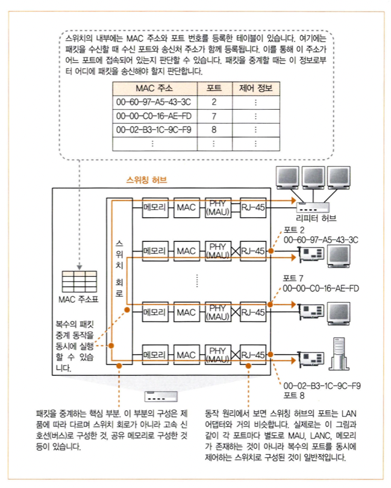
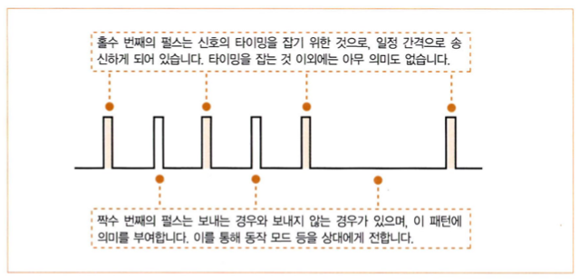

# story 2. 스위칭 허브의 패킷 중계 동작
- 스위칭 허브는 패킷의 신호를 수신하여 디지털 데이터의 형태로 되돌려주고, 다시 신호로 고쳐서 송신하는 동작을 통해 패킷을 운반한다.

## 1. 스위칭 허브는 주소 테이블로 중계한다
- 스위칭 허브는 이더넷의 패킷을 목적지로 중계한다.
> "이더넷의" 패킷이란, LAN 환경에서 MAC 주소를 가지고 운반되는 패킷을 의미한다. (데이터 링크 계층)  

### 스위칭 허브의 내부 구성

- MAC 주소표
  - MAC 주소와 포트 번호를 등록한 테이블
  - 패킷을 수신할 때, 송신처 주소와 수신 포트가 함께 등록
    - 기기의 MAC 주소와, 기기가 어느 포트에 존재하는지에 대한 정보이다.
  - 패킷을 어디에 송신해야 하는지 판단할 수 있다.
- 스위치 회로
  - 패킷을 중계하는 핵심 부분
  - 입력 포트와 출력 포트를 연결할 수 있는 전자 회로
  - 격자 모양으로 신호선을 배치, 각 교점에 스위치가 있는 형식
    - 제품에 따라 구성 방식은 다르다. (회로 / 고속 신호선 / 공유 메모리 ...)
  - 여러 개의 포트를 가지고, 복수의 포트를 스위치가 동시에 제어한다.
  - 복수의 패킷 중계 동작을 동시에 실행할 수 있다.

- 포트
  - 커넥터와 안쪽에 있는 회로 부분
  - 스위칭 허브의 각 포트는 PC의 LAN 어댑터와 거의 같다.
  - 하지만 LAN 어댑터와 달리, 수신처 MAC 주소를 검사하지 않고 모든 패킷을 수신한다.
  - 즉, MAC 주소가 할당되어있지 않다. (단, 관리 기능을 가진 프로세서 내장 스위칭 허브는 예외)

## 스위칭 허브의 동작
MAC 주소표에서 MAC 주소를 조사하고, 해당하는 포트에서 신호를 송신한다.
1. 신호가 커넥터에 도달하여 `PHY(MAU) 회로`에서 수신됨
2. `PHY(MAU) 회로`에서 공통의 신호 형식으로 변환하여 `MAC 회로`로 들어감
3. 디지털 데이터로 변환
4. 패킷의 FCS를 대조하여 오류 유무 검사, 문제 없으면 버퍼 메모리에 저장 (오류가 있으면 패킷을 폐기)
> 위와 같은 저장 과정까지는 LAN 어댑터와 거의 같다.
5. 수신처 MAC 주소와 일치하는 것이 `MAC 주소표`에 등록되어 있는 지 조사하여 패킷을 어느 포트에서 송신할지 판단
6. `스위치 회로`를 경유하여 `송신측의 포트`에 패킷을 보냄
7. `MAC 회로`나 `PHY(MAU) 회로`가 송신 동작을 신행
8. 이더넷의 규칙에 따라 케이블에 신호가 흘러감
9. 아무도 송신 중이지 않을 때, 소켓을 신호로 변환하여 송신
10. 송신 동작 중 다른 기기가 보낸 신호가 들어오면, 패킷 충돌을 방지하기 위해 재밍 신호를 보냄

> - 송신측의 포트란?  
> 스위치 회로는 입력측 -> 출력측 의 방향을 가진다.  
> 입력측은 수신측 포트에, 출력측은 송신측 포트에 접속되어 있다.  
> 2번 포트에서 패킷의 수신처 주소가 8번 포트에 있다는 것을 알았다면, 입력측의 2번 포트에서 8번 포트를 송신측 포트(목적지)로 하여 스위치 회로에 패킷의 신호를 흘린다.

## 2. MAC 주소 테이블을 등록 및 갱신한다
스위칭 허브가 패킷을 중계할 때, MAC 주소표 내용의 갱신 동작도 같이 실행한다.  
스위칭 허브는 아래와 같은 방식으로 MAC 주소표의 내용을 스스로 등록 및 삭제하므로, 수동 관리가 필요 없다.  

1. 패킷을 수신할 때, 패킷을 송신한 기기의 주소도 등록한다.
   - 한 번이라도 패킷을 송신하면, 해당 기기의 MAC주소가 주소표에 등록된다.
2. MAC 주소표에 등록한 정보는 사용하지 않고 일정 시간이 경과하면 삭제한다.
   - 기기가 이동하면 기존에 등록한 주소는 유효하지 않게 된다.
   - 따라서 통신할 수 없는 오래된 정보를 삭제하기 위함이다.

## 3. 예외적인 동작
### 패킷을 수신한 포트와 송신 포트가 같은 경우
- 주소표에서 찾은 송신 포트가 패킷을 수신한 포트와 같을 때
> 1. `PC A`에서 보낸 패킷이 `리피터 허브`에 도착
> 2. `모든 포트`에 뿌려져서 `스위칭 허브`와 `PC B`에 도착
> 3. `스위칭 허브`는 패킷 중계를 위해 같은 패킷을 다시 `리피터 허브`에 반송  
> - 이 때 스위칭 허브는 리피터 허브로부터 받은 패킷을 다시 리피터 허브에 보낸다. (수신 = 송신)  
> - PC B는 **같은 패킷을 두 번 받게 된다.**
- 위와 같은 문제 때문에 스위칭 허브는 패킷을 중계하지 않고 폐기한다.

### MAC 주소표에 수신처 MAC 주소와 일치하는 주소가 없는 경우
- 어느 포트에서 송신해야 할지 판단할 수 없음
- 패킷을 수신한 포트 이외의 전체 포트에서 패킷을 송신
- 이후 수신 측에서 응답이 돌아오면, 그 때 주소표에 등록되므로 이러한 상황은 한 번만 발생한다.

## 4. 전이중 모드에서 송신과 수신을 동시에 실행한다
### 전이중 모드
- 송신과 수신을 동시에 실행할 수 있는 `동작 모드`로, 스위칭 허브의 특징이다.
- 반면 리피터 허브는 동시에 송신을 개시하면 신호가 뒤섞여서 파괴되는 `충돌` 현상이 일어난다. 

### 송신, 수신의 분리
- 송신과 수신 신호를 나누면 충돌하지 않는다.
- `트위스트 페어 케이블`의 신호선이 송신용과 수신용으로 나뉘어져 있다.
- 스위칭 허브의 `포트` 부분, LAN 어댑터의 `PHY(MAU) 회로`와 `MAC 회로`의 내부도 송신과 수신이 나뉘어져 있다.

### 이더넷과 전이중 모드
- 이더넷의 규칙
  - 신호가 흐르고 있으면, 끝나길 기다렸다가 송신 동작을 실행해야 한다.
- 하지만 충돌이 일어나지 않는 `전이중 모드`에 대해서는 규칙이 다르게 개정되었다.
  - 신호가 흐르고 있어도 상관하지 않고 송신할 수 있다.
  - 충돌을 검출하는 회로를 무효화한다.
- 따라서 `전이중 모드`는 반이중 모드보다 빠르고, 성능이 좋다.

> 전이중(Full duplex) <-> 반이중(Half Duplex)  
> 통신 회선의 분야에서 사용하던 용어  
> - 전이중은 두 디바이스 간 통신선이 두 개, 송수신이 동시에 가능함
> - 반이중은 두 디바이스 간 통신선이 하나, 송수신을 동시에 할 수 없음

## 5. 최적의 전송 속도로 보내는 자동 조정
### 자동 조정(auto negotiation) 기능
- `동작 모드`(전이중 모드와 반이중 모드)를 자동으로 전환
- 상대의 전송 속도를 검출하여 전송 속도를 자동으로 전환

### 자동 조정 작동 원리
- 이더넷은 데이터가 흐르고 있지 않을 때 동작 확인용으로 `링크 펄스`라는 펄스형의 신호를 흘린다.
    
- 자동 조정 기능은 이 펄스 신호를 특정 패턴으로 송신하는 방식을 이용한다.
  - 스위칭 허브와 LAN 어댑터가 서로 지원 가능한 작동 모드와 전송 속도를 통지한다.
  - 그 중 최적의 조합을 선택해 설정한다.
  
## 6. 스위칭 허브는 복수의 중계 동작을 동시에 실행한다
- 수신처 MAC 주소의 기기가 존재하는 포트 외의 다른 포트는 빈 상태이다.  
- 빈 포트에 별도의 패킷을 흘려 여러 개의 패킷을 중계할 수 있다.
> 반면, 리피터 허브는 들어온 신호를 모든 포트에 뿌리기 때문에 위와 같이 동작할 수 없다.  
> 기기 전체에서 중계할 수 있는 패킷의 수 : 스위칭 허브 > 리피터 허브
