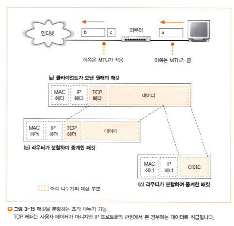

# story 3. 라우터의 패킷 중계 동작
스위칭 허브를 경유한 패킷은 결국 라우터에 도착한다. 라우터는 이를 그 다음 라우터로 중계한다.  
스위칭 허브는 이더넷을 기반으로 MAC 주소로 패킷을 중계했다면, 라우터는 IP 주소를 바탕으로 패킷을 중계한다.    

## 라우터
- 간략화하자면, 중계 부분과 포트 부분 두 부분으로 구성되어 있다.
  - 중계 부분 : 패킷의 중계 대상 판단
  - 포트 부분: 패킷을 송수신
- 컴퓨터가 LAN 어댑터에 따라 이더넷뿐만 아니라 무선 LAN도 지원할 수 있는 것처럼, 마찬가지이다.
  - 라우터도 무선 LAN용 하드웨어를 장착했다면 지원 가능하다.
  

### 포트 부분
- 포트 부분에서 패킷을 수신하는데, 포트 부분의 통신 기술 규칙에 따라 동작이 다르다.
- 라우터의 각 포트에는 MAC 주소와 IP 주소가 할당되어 있다.
- 라우터에서 포트 부분은 패킷의 송신처/수신처가 되어 이를 송수신한다. 포트에 IP 주소도 할당되어 있기 때문에 가능하다.  
  - 스위칭 허브와의 차이점: 스위칭 허브는 패킷을 전송하기만 하고, 자신이 송신처/수신처가 되지 않는다. 직접 송수신 동작을 하지 않는다.

> 포트가 이더넷인 경우 ?  
> 포트가 이더넷이면, 그 포트가 할당된 MAC 주소의 송신처나 수신처 그 자체가 된다.

### 중계 부분
- 중계 부분에서는 헤더에 등록된 수신처 IP 주소와 중계 대상을 등록한 표를 기준으로 대상을 판단한다.
  - 이 표를 라우팅 테이블, 또는 경로표라고 한다.
  - 스위칭 허브와의 차이점: 스위칭 허브는 수신처 MAC 주소로 중계 대상을 판단한다.

### 라우팅 테이블 (경로표)

- 수신처 : 서브넷 자체를 나타내는 주소
    - 호스트 번호 부분의 비트값은 모두 0으로 되어있다.
    - 101동 202호가 아니라, 101동은 여기, 102동은 저기로 가라는 식으로 중계하는 것이다.
    - 단, 여러 개의 서브넷을 모아서 한 개의 서브넷처럼 묶은 것을 경로표에 등록할 수도 있다.
        - (ex) `10.10.1.0/24`, `10.10.2.0/24`, `10.10.3.0/24` -> `10.10.0.0/16`
    - 반대로 한 개의 서브넷을 세분화해서 등록할 수도 있다.
- 넷마스크: 어디까지가 네트워크 번호 부분인지 판단하기 위함
- 게이트웨이: 패킷의 중계 대상의 IP 주소
- 인터페이스(포트): 라우터에서 인터페이스란 말과 포트란 말은 같은 의미이다. 패킷의 중계 대상
  -> 수신처, 넷마스크에 해당하는 포트에서, 게이트웨이 항목에 등록되어 있는 IP 주소를 가진 라우터에 대해 패킷을 중계한다.
- 메트릭: 기록된 목적지가 까가운지, 먼지 나타냄 (클 수록 멀다)

- 경로 정보 등록하는 방법은 크게 두 가지이다. 
  - 수동 등록/갱신
  - 라우터들끼리 경로 정보를 교환하는 라우팅 프로토콜 사용

## 라우터의 패킷 수신 동작
- 책에서는 라우터의 포트 종류 중 이더넷의 포트에서 패킷 수신 동작에 초점을 맞춰 설명함.
- 이더넷의 포트 부분 구조는 PC의 LAN 어댑터와 거의 같다.  
- MAC 헤더의 수신처 MAC 주소가 자신에게 해당하면 패킷을 수신 버퍼 메모리에 저장, 아니면 폐기한다.
- 패킷 수신 동작이 끝나면, 이 MAC 헤더는 역할을 다 했으므로 폐기한다.
- 그 후 IP 헤더의 내용을 보고 패킷 중계 동작에 들어간다.

### 중계 대상이 불분명한 경우
- 중계표에 해당하는 경로가 없다면 패킷을 폐기하고, 송신처에 이 사실을 통지한다. (ICMP 프로토콜 이용)
  - 라우터는 스위칭 허브와 달리 큰 네트워크 규모에도 쓰이므로, 중계 대상이 분명하지 않은 패킷은 폐기하는 것이다.
- 하지만 기본 게이트웨이 설정으로 이런 문제를 방지할 수 있다.
  - 넷마스크가 `0.0.0.0`이면 IP 주소와 수신처 항목을 비교할 비트 수가 0이라는 것으로, 모든 주소에 일치하다고 판단한다.   
  - 그래서 넷마스크를 `0.0.0.0`으로 두고, 해당 행의 게이트웨이에 기본 경로를 등록해놓으면 중계 대상이 분명하지 않은 문제가 발생하지 않는다.

## 송신 전의 일들

### 패킷 유효기간
- 중계대상을 찾은 패킷을 출력 측의 포트로 옮기고 송신한다.
- 그 전에, IP 헤더의 필드인 TTL(생존 기간)을 갱신한다.
  - 이 값은 라우터를 옮길 때마다 값을 1씩 줄인다.
  - 패킷이 같은 장소를 계속 순환하는 것을 방지하기 위함이다.

### 큰 패킷 조각 나누기 
- 회 또는 LAN 종류(이더넷 뿐만 아니라 다른 LAN, 통신 회선의 경우 등)에 따라 패킷의 최대 길이가 달라진다.
- 따라서 출력 포트측의 최대 길이가 입력측보다 작을 수 있다.
- 또는, 입출력 간 패킷의 최대 길이는 간 같아도, 여분으로 헤더를 부가해서 출력측의 패킷 최대 길이를 초과할 수도 있다.
- 이 경우 IP 프로토콜에 규정된 조각 나누기 방법을 사용해 패킷을 쪼갠다.

1. 출력측의 MTU를 조사한다.
2. 출력측의 MTU가 작은 경우에는, IP 헤더의 플래그 필드를 조사하여 분할해도 좋을지 확인한다.
3. 플래그 필드가 분할 불가로 되어있으면 패킷을 폐기하고, 송신처에 통지한다.
4. TCP 헤더도 데이터로 간주해서 TCP 헤더 이후의 부분을 잘라서 분할하고, IP 헤더를 덧붙인다.
  

## 라우터의 송신 동작
- 송신 동작은 출력측의 포트에 따라 다르다.
  - ex) 이더넷 포트: 이더넷의 규칙에 따라 패킷을 신호로 변환하여 송신
- 이더넷의 예시
  - 이더넷은 패킷의 맨 앞 부분에 MAC 헤더를 부가하고, 패킷을 완성해 전기신호로 변환한다.
  - 수신처 MAC 주소 필드에 패킷을 받을 상대의 MAC 주소를 설정한다.
    1. 경로표를 보고 건네줄 상대를 찾기
       1. 게이트웨이 항목에 IP 주소가 쓰여있으면 이 IP 주소가 건네줄 상대이다.
       2. 게이트웨이 항목이 공란이면, IP 헤더의 수신처 IP 주소가 건네줄 상대이다.
    2. 상대의 IP 주소가 결정되면 ARP로 MAC 주소를 조사한다.
  - 송신처의 MAC 주소로는 출력 측의 포트에 할당된 MAC 주소를 설정한다.
- 이 패킷은 이제 MAC 주소를 가지고 있으므로 스위칭 허브를 경유하여 다음 라우터에 도달할 수 있다.

### 라우터와 스위칭 허브의 관계
- 라우터는 IP의 개념에 기초하여 만들어졌고, 스위칭 허브는 이더넷에 기초하여 만들어졌다.
- 라우터는 패킷을 운반하는 일을 스위칭 허브에 의뢰한다.
- 단 위와 같은 설명은, '순수한' 라우터나 스위칭 허브를 가정하고 있다.
- 실제로는 스위칭 허브를 내장한 라우터도 있고, 다양한 유형이 있다.
