# chapter4. 액세스 회선을 통해 인터넷의 내부로
## 액세스 회선과 프로바이더의 탐험
패킷이 **인터넷 접속용 라우터를 경유하여 인터넷 안으로 들어가 진행하는 부분**을 이야기할 것이다.

# Story1 : ADSL기술을 이용한 액세스 회선의 구조와 동작
가정이나 회사의 LAN은 액세스 회선이라는 통신 회선으로 프로바이더에 연결되어 있다.

액세스 회선에는 여러 종류가 있는데 그 중 adsl기술을 이요한 액세스 회선에 대해 설명한다

- ADSL 액세스 회선의 구성
- 전화선 속을 흐르는 신호
- 전화와 공존시키는 방법

등을 알게 될 것이다.

## 1. 인터넷의 기본은 가정이나 회사의 LAN과 같다

라우터에서 패킷을 중계하는 부분 = 가정이나 회사의 LAN과 같다.

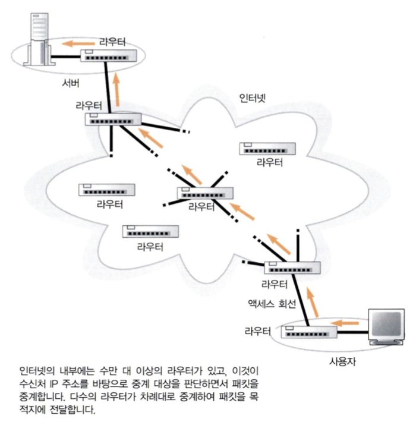

가정, 회사의 LAN과의 차이점

1. **중계 장치 간의 거리**

   : 회사나 가정의 lan은 수미터에서 수백 미터 정도. = 이더넷 케이블을 연장했을 때 인접 중계 장치에 연결이 가능

   : 인터넷은 가장 가까운 전화국에 도착하기 위해서 수킬로 = 이더넷 케이블로 미국-한국을 연결하는 것은 불가능

2. 라우터에서 **경로 정보의 등록 방법**

   기본적으로 경로표에 기초하여 중계 대상을 판단하는 기본동작은 같지만. 경로표에 정보 등록하는 부분이 다르다.

   : 인터넷 라우터에는 경로 정보가 10만개 이상 + 정보도 시시각각 변화(통신회선에 장애가 생기거나, 새로 접속하는 회사가 있기 때문)

---

## 2. 사용자와 인터넷을 연결하는 액세스 회선

스위칭 허브와 라우터로 패킷 중계하면, 목적지 서버를 향해 진행→ **인터넷 접속용 라우터에 도착 → 인터넷에 접속**

- 인터넷 접속용 라우터의 **패킷 중계동작은 이더넷의 라우터와 거의 같다.**
- 인터넷 접속용 라우터의 **패킷 송신 동작은 이더넷의 패킷 송신 동작과 다르다.**

  : 이유는, **인터넷 접속용 라우터가** 이더넷 규칙과 다른, **액세스 회선의 규칙에 따라 패킷 송신 동작을 실행**하기 때문이다.

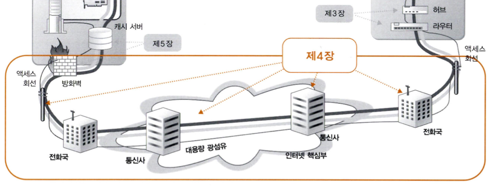

### *액세스 회선이란?

**: 인터넷과 가정이나 회사의 LAN을 연결하는 통신회선.**

(액세스 회선은 통신 회선의 사용법을 나타냄. 회사 등에서 사용하는 전용회선이라는 종류의 통신회선은 인터넷 접속용일 때는 액세스 회선이 되지만, 본사와 지점을 연결할 때는 액세스 회선이라고 부르지 않는다. 그냥 전용회선임.)

- 일반 가정에서는  ADSL, FTTH 등을 액세스 회선으로 이용. 회사의 경우 전용 회선등이 추가된다.

### ADSL

: "Asymmetric Digital Subscriber Line"의 약어로, **디지털 가입자 회선을 이용하여 고속 인터넷 연결을 제공하는 기술**입니다. ADSL은 주로 가정이나 소규모 사업장에서 인터넷 접속을 위해 사용되며, **전화선을 통해 데이터 통신을 할 수 있는 기술**입니다.

ADSL은 "비대칭"이라는 용어가 들어가는데, 이는 업로드와 다운로드 속도가 다르다는 뜻입니다. ADSL은 다운로드 속도가 업로드 속도보다 훨씬 빠르게 제공되는 것이 특징입니다. 일반적으로 가정에서는 더 많은 데이터를 다운로드하는 경우가 많기 때문에 이러한 비대칭성이 유용합니다.

ADSL은 **전화선과 같은 구리 선로를 이용하여 데이터를 전송**하며, **전화와 데이터 통신을 동시에 가능**하게 합니다. **ADSL 모뎀**을 사용하여 전화선에 연결하고, 인터넷 서비스 제공자의 네트워크와 연결하여 인터넷에 접속할 수 있습니다.

### FTTH

FTTH는 "Fiber to the Home"의 약어로, **집까지 광섬유를 연결하여 인터넷 서비스를 제공하는 기술**입니다. 이 기술은 광섬유 케이블을 사용하여 고속 인터넷 연결을 제공하며, 광섬유의 높은 대역폭과 안정성을 활용하여 다양한 데이터 통신 서비스를 지원합니다.

FTTH는 다른 기술에 비해 고속이며 안정적인 인터넷 연결을 제공하며, 대역폭이 크기 때문에 대용량 데이터 전송, 고화질 비디오 스트리밍, 온라인 게임 등 다양한 인터넷 활동을 원활하게 수행할 수 있습니다.

---

## 3. ADSL 모델에서 패킷을 셀로 분할한다

ADSL 액세스 회선의 구성(PPPoE인 경우)

왼쪽←오른쪽 으로 패킷이 흘러간다.

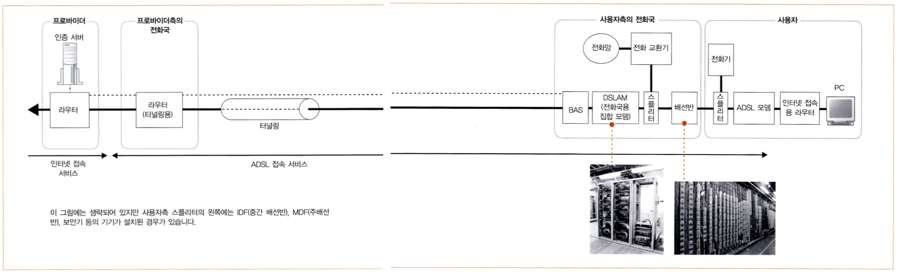

1. 사용자 측의 라우터에서 송신된 **패킷**
2. **ADSL 모뎀이나 전화의 케이블을 통해 전화국에 도착**
3. **ADSL사업자의 네트워크를 경유하여**
4. **프로바이더(ISP: internet service provider)에 도착한다**

프로바이더에 도착하는 동안 패킷은 여러 형태로 모습을 바꾸며 진행된다.

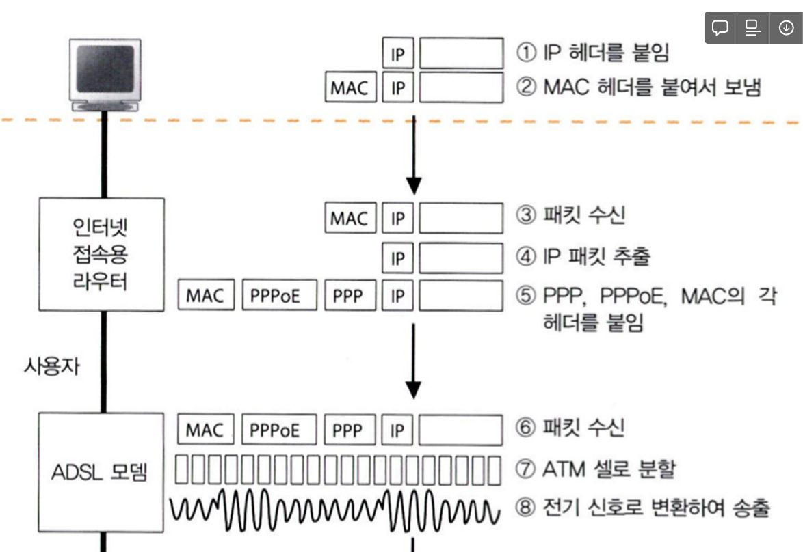

1. 클라이언트에서 만든 패킷이 리피터 허브나 스위칭 허브 경유하여 **인터넷 접속용 라우터에 도착**
2. 이더넷의 패킷에서 IP 패킷을 추출하여 중계 대상을 판단하고, 패킷을 송신함
3. 인터넷 접송용 라우터와 ADSL 모뎀이 **이더넷으로 연결되어 있으면 이더넷 규칙에따라 패킷 송신 동작 실행**

   단, 이더넷의 헤더가 액세스 회선 사업자에 따라 변경된다

    - **인터넷 접속용 라우터는 mac, PPPoE, PPP헤더가 붙**고
    - 이더넷 규칙에 따라 **신호로 변환해 모뎀에 패킷을 보낸다**.
4. 패킷은 ADSL 모뎀에 도착한다.(ADSL 모뎀이 이더넷으로 연결되면 이더넷 규칙에 따라 패킷 송신함)
5. ADSL **모뎀은 패킷을 셀로 작게 분할한다.**
    - 셀은  앞부분에 5바이트 헤더를 가짐 + 48바이트 데이터로, 매우 작은 디지털 덩어리.
    - ATM이라는 통신 기술에 사용
    - 셀로 분할하는 이유 : ADSL 기술 개발이 시작되던 당시, 통신 업계에서는 ATM이 유력. 이 경우, 셀을 사용하는 상태로 두면 다른 설비와 매끄럽게 연대되어 설비투자 줄일 수 있기 때문.
    - 실제로 셀로 분할하지 않는 유형의 adsl 모뎀 사용하는 adsl 사업자도 있다.
6. **셀을 전기신호로 바꾸어 스플리터에 송신한다**

---

### ATM이란?

"Asynchronous Transfer Mode"의 약자로, **비동기 전송 방식을 의미하는 통신 기술**입니다. ATM은 고속 데이터 전송을 위한 표준화된 프로토콜로서, **주로 광대역 네트워크 또는 전화 네트워크에서 사용**되었다.

ATM은 다양한 종류의 데이터, 음성, 비디오 등 다양한 미디어 유형을 효율적으로 전송하기 위해 개발되었습니다. 주요한 특징 중 하나는 **고정 길이의 셀이라는 작은 패킷을 사용하여 데이터를 전송**하는 것

### 인터넷 접속용 라우터와 ADSL 모뎀은 어떻게 연결되나?

일반적으로 ADSL 모뎀과는 **이더넷 케이블 또는 무선 연결을 통해 연결**되며, ADSL 모뎀이 제공하는 인터넷 신호를 받아서 로컬 네트워크를 통해 여러 기기에 분배합니다.

요약하면, ADSL 모뎀은 전화선을 통해 인터넷 신호를 받아오고, 인터넷 접속용 라우터는 이 인터넷 신호를 받아서 로컬 네트워크로 분배하는 역할을 한다.

### 인터넷 접속용 라우터란? : 같이 얘기 해 봅시다!!!!!!!!!!!!!!!!!!!!!!!!!!!

"인터넷 접속용 라우터"와 "라우터"는 기본적으로 같은 개념을 나타내지만, 문맥에 따라 약간의 차이가 있을 수 있습니다. 여기서는 이 두 용어의 기본적인 의미와 가능한 차이점에 대해 설명하겠습니다.

- **라우터 (Router):**
  라우터는 네트워크에서 **데이터 패킷을 전송하고 라우팅하는 역할을 수행하는 장치**입니다. 네트워크를 구성하는 여러 장치 사이에서 데이터를 전송하고 수신하는 역할을 하며, 여러 개의 네트워크를 연결하여 패킷이 목적지로 안전하고 효율적으로 도달하도록 보장합니다. 라우터는 IP 주소를 기반으로 패킷을 라우팅하며, 이를 통해 다른 네트워크와 통신할 수 있도록 합니다. 또한 보안 기능, NAT(Network Address Translation), 포트 포워딩 등을 통해 네트워크의 안전성과 관리를 제공합니다.
- **인터넷 접속용 라우터 (Internet Gateway Router):**
  "인터넷 접속용 라우터"는 일반적으로 가정이나 사무실에서 **인터넷 서비스 공급자(ISP)로부터 제공받은 인터넷 연결을 네트워크 내부 장치들과 공유하도록 설치되는 라우터**를 가리킵니다. 이 라우터는 ISP로부터 받은 인터넷 신호를 받아들이고, 내부 네트워크에 있는 장치들이 이 인터넷 연결을 사용할 수 있게 합니다.

  이 라우터를 통해서 인터넷에 접속할 수 있게 되는 것이다.

  과정)

    1. 패킷이 외부로 나가야 하는 경우, **ISP의 제공 네트워크로 패킷을 전달**. 이때 라우터는 목적지 IP 주소에 따라 패킷을 **적절한 출력 포트로 라우팅한다. 이렇게 패킷이 ISP의 네트워크로** 나가게 됩니다.
    2. **ISP와 외부 네트워크로 전달:** 라우터가 ISP로 전송한 패킷은 ISP의 네트워크를 통해 목적지로 전달됩니다. ISP는 인터넷에 연결된 큰 네트워크의 일부입니다. 이렇게 하여, 패킷은 목적지인 웹사이트 서버까지 도달하게 됩니다.

결론적으로, "라우터"는 네트워크에서 데이터 패킷을 관리하고 전송하는 역할을 일반적으로 가리키는 용어이며, "인터넷 접속용 라우터"는 인터넷 서비스 공급자로부터 받은 **인터넷 연결을 내부 네트워크에서 공유하도록 설치된 라우터를 특정함.**

### 가정용 와이파이 공유기는 인터넷 접속용 라우터일까?

YES!

이 라우터는 인터넷 서비스 공급자**(ISP)로부터 받은 인터넷 연결을 가정 내부의 여러 장치들과 공유할 수 있도록하기** 때문이다.

- isp 연결 관리 : 인터넷 접속용 라우터는 가정 내부 장치들이 isp로 부터 제공 받은 인터넷 신호  사용하게 함
- 내부 네트워크 관리 : 내부 네트워크에서 ip주소 할당을 관리
- NAT 기능 제공 : 하나의 공인 IP 주소로 인터넷에 접속할 수 있다. 방화벽과 포트포워딩의 보안기능을 제공해 내부 네트워크를 보호한다

라우터가 NAT(네트워크 주소 변환)라는 기술을 사용하여 내부 네트워크의 ip주소들을 하나의 공인 ip주소로 변환하여 외부로 나가는 패킷을 관리한다. 여러 내부 장치들이 인터넷에 접속할 수 있게 되지만, 외부에서 보는 공인 IP 주소는 라우터의 IP 주소인 것이다.

따라서, 단일 와이파이 공유기에 연결된 장치들은 모두 동일한 IP주소를 가지고 있다.

### 스위칭 허브와 인터넷 접속용 라우터

- 스위칭 허브 :
    - 네트워크 내부에서 여러대의 장치들을 연결하여 데이터를 주고받을 수 있게 하는 장치
    - 주로 이더넷 케이블을 이용해 여러 장치들을 연결하여 내부 네트워크를 구성한다
    - 데이터 프레임을 수신한 후 목적지 주소를 보고 해당 포트로만 데이터를 전송한다
- 인터넷 접속용 라우터 :
    - **내부 네트워크와 외부 인터넷 연결해주는 역할**
    - 내부 네트워크의 장치들이 인터넷에 접속할 수 있도록 **ISP로부터 받은 인터넷 신호를 관리하고 공유**

      : ISP는 아래과 같은 내용을 담은 신호를 제공

      (인터넷 사용하기 위해 라우터가 필요한 설정과 연결정보/ 공인 IP주소 할당/ 연결종류와 속도 정보 등)

### 우리집 와이파이 공유기는 스위칭 허브와 인터넷 접속용 라우터 역할을 동시에 한다

- 스위칭 허브 역할 : 여러개의 이더넷 포트를 가지고 유선으로 연결된 장치들을 스위칭 허브처럼 관리. 내부에서 유선 네트워크 기기들끼리 데이터 주고받을 수 있음
- 인터넷 접속용 라우터 역할 : 외부 인터넷과 내부 네트워크를 연결

### 데이터 송신과정에 붙는 패킷들 재 정리(내부/외부)

1. **데이터 전송 내부 과정: (데이터 링크 계층)**
    - **MAC 주소:** 이더넷 프레임은 목적지 및 출발지 장치의 MAC 주소 포함. 내부 네트워크에서 데이터가 정확한 장치로 전달되도록 하기 위해서.
    - **프리앰블과 스타트프레임 딜리미터:** 이들은 데이터 프레임의 시작을 표시하기 위한 신호. **로컬 네트워크에서 전송되는 이더넷 프레임에만 사용. 외부로 전송되는 패킷에는 이러한 요소가 포함되지 않는다.**
    - **FCS 헤더:** 데이터 프레임의 오류 검사를 위한 정보
2. **외부 인터넷 출력 과정: (네트워크 계층)**
    - **PPPoE, PPP 헤더:** 인터넷 접속을 위해 일반적으로 PPPoE (Point-to-Point Protocol over Ethernet) 프로토콜이 사용되는데, 이는 **이더넷을 통해 PPP 프레임을 전송하고, 인터넷 서비스 공급자(ISP)와의 연결을 설정**합니다. PPP 프레임에는 PPP 헤더와 정보가 포함되어 있습니다.

      참고로, PPPoE(PPP over Ethernet)와 PPP(Point-to-Point Protocol) 헤더는 논리적인 계층에서의 프로토콜이다.

    - **NAT 및 라우팅:** 가정용 와이파이 공유기는 Network Address Translation (NAT)를 통해 내부 IP 주소를 공인 IP 주소로 변환하며, 라우팅을 통해 데이터가 외부로 전송됩니다.

### 외부 인터넷 출력과정에 보내는 패킷에 프리앰블과 스타트프레임 딜리미터가 필요 없는 이유

- 인터넷을 통한 데이터 전송은 이더넷과 같은 로컬 네트워크 전송과는 다른 물리적인 매체와 프로토콜을 사용한다.
- 이더넷의 프리앰블과 스타트 프레임 딜리미터는 이더넷 케이블에서의 데이터 전송을 위한 타이밍 동기화를 위해 사용된다.
- 인터넷으로 전송되는 데이터는, 이더넷의 물리적 특성과는 다른 특성을 가진다
- 인터넷 프로토콜

---

## 4. **ADSL은 변조 방식으로 셀을 신호화 한다**

1. 셀에 저장한 뒤에 이것을 신호로 변환

   LAN의 경우, 사각형 신호를 이용해 0과 1을 나타내는 간단한 방식의 디지털 신호로 변환했지만,

   사각형 신호는 파형이 뭉개지기 쉽고 거리가 떨어지면 오류 일으키기 쉬움 + 주파수 범위가 넓어서 잡음 제거하기 어렵다.

   변조기술 = 완만한 파형을 합성한 신호에 0과 1의 비트값을 대응하는 기술

   ADAL은 진폭 변조(ASK)와 위상변조(PSK)를 결합한 ⇒ 직교 진폭 변조(QAM)을 사용

    - 진폭 변조(ASK) :
        - 신호의 진폭을 높이거나 낮추는 것으로 정보를 전송합니다. '0'과 '1' 디지털 비트를 다른 진폭 레벨로 표현하는 방식.
        - 신호의 세기, 즉 신호의 진폭 크기에 따라 0과 1을 대응. 진폭이 작은 신호는 0
        - 단계를 늘려 대응하는 비트수를 늘릴 수 있다. 예를들어 진폭을 4단계로 나누면 한번에 2개의 비트를 나타낼 수 있음.
          가장 작은 진폭은 00,→01→10→네번째는 11
        - 이 과정을 통해 **운반하는 데이터 양이 2배로 늘어나서 속도가 향상된다.**

          = 단위 시간당 전송되는 비트 개수(비트전송률)이 높아진다. (한번에 2개의 비트가 전송되므로)

          but 변조속도(심볼 당 전환 수 가 높아져 복잡한 신호가 전송된다) = 항상 빠른 건 아ㅣㄴ란 뜻

        진폭이 8단계면 3비트, 16단계면 4비트 식으로 **비트 수를 늘려 고속화된다.**
        
        그러나, 단계를 너무 많이 늘리면 수십측에서 인접 단계와 오인할 가능성이 커져 오류의 원인이 된다
        
        (= 신호는 전달 도중에 잡음 영향 받아 파형이 변하기 때문에, 00인지  01인지 구분 못할 수 있음)
        
    - 위상변조(PSK) : 신호의 위상에 0과 1을 대응시키는 방법. 물결의 위아래 위치를 조금씩 바꾸면 그 물결의 형태가 변하게 되는데, 이와 비슷한 원리입니다. 이렇게 신호의 위상을 조절하여 다양한 정보를 나타낸다.
    - 직교 진폭 변조(QAM) : **두 개의 주파수 신호를 동시에 사용하여 정보를 전송**하는 방식입니다. 이것은 실제로는 위상 변조와 진폭 변조를 합친 형태로 볼 수 있습니다. 간단히 말해서, 한 신호는 위상 변조를 통해, 다른 신호는 진폭 변조를 통해 변조됩니다. 이 두 신호는 **서로 직교(90도 차이)하게 만들어지기 때문에 "직교"라는 이름**이 붙었습니다.
        
        예를들어, 
        
        직접 물결을 만들어 휴대폰의 피쳐폰을 통해 무언가를 전달하려고 한다고 가정해봅시다. 이때 물결의 크기(진폭)과 위상을 조절함으로써 다양한 모양의 물결을 만들어 낼 수 있습니다.
        
        - 물결의 진폭을 높이면 더 크게 휘어지는 물결을 만들 수 있습니다.
        - 물결의 진폭을 낮추면 작게 휘어지는 물결을 만들 수 있습니다.
        - 물결의 진폭은 크게 유지하되 시작점을 바꾸면 물결의 위상이 변경됩니다.
        
        이와 비슷한 원리로 "직교 진폭 변조"는 디지털 데이터를 전송하기 위해 신호의 진폭과 위상을 변화시켜 다양한 정보를 나타내는 것입니다. 이 방식은 주파수 대역 내에서 여러 개의 신호를 동시에 전송할 수 있도록 해주며, 높은 데이터 전송률과 효율적인 스펙트럼 활용을 가능하게 합니다. "직교 진폭 변조"는 주로 통신 시스템에서 다양한 변조 방식 중 하나로 사용되며, QAM(Quadrature Amplitude Modulation)이라는 용어로도 흔히 불립니다.
        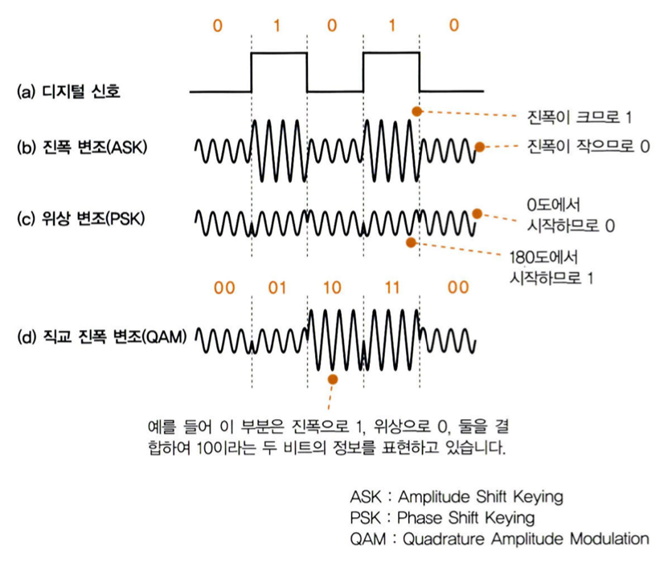

--- 

## 5. ADSL은 파를 많이 사용하여 고속화를 실현한다

1. ADSL이 파를 많이 사용하여 고속화를 실현한다는 말의 뜻
    
    [ADSL은 여러가지 주파수 대역을 사용한다]
    
    ADSL(Asymmetric Digital Subscriber Line)은 디지털 데이터를 **주파수 분할 다중화(Frequency Division Multiplexing)를 사용하여 전화선을 통해 전송하는 기술**입니다. 주파수 분할 다중화는 **다양한 주파수 대역을 사용하여 다른 데이터 스트림을 병렬로 전송하는 방식**을 말한다.
    
    이 때, **"사용하는 파"는 주파수 대역을 의미**합니다. 
    
    ADSL은 전화선에서 다양한 주파수 대역을 할당하여 다운로드와 업로드 작업을 동시에 처리합니다. 
    다운로드와 업로드 **각각의 작업을 위한 주파수 대역을 할당하여 동시에 데이터를 전송**할 수 있도록 합니다.
    
    [ADSL은 각 주파수 대역 내에서 데이터를 진폭레벨과 위상으로 표현하는데 직교 진폭 변조 방식을 사용다]
    
    "직교 진폭 변조"는데이터를 전송하기 위해 신호의 진폭(크기)과 위상(진행 상태)을 함께 사용하여 다양한 정보를 표현하는 방식을 말합니다. QAM은 주로 **주파수 대역 내에서 데이터를 다양한 진폭 레벨과 위상으로 표현하는데 사용**됩니다. 이를 통해 **다양한 비트를 나타낼 수 있으며, 더 높은 비트 전송률과 스펙트럼 효율성을 제공**합니다.
    
    [정리]
    
    ADSL은 **다양한 주파수 대역을 사용하여 데이터를 전송**하는데, 이 때 사용되는 주파수 범위가 "파"입니다. "직교 진폭 변조"는 QAM으로, **주파수 대역 내에서 진폭과 위상을 조합하여 디지털 데이터를 변조하여 전송하는 방식**을 의미합니다.
    
2. 사진을 통한 설명 : 수백개의 파를 생성하고, 각 파에 대해 직교 진폭 변조로 비트값을 전송한다.

    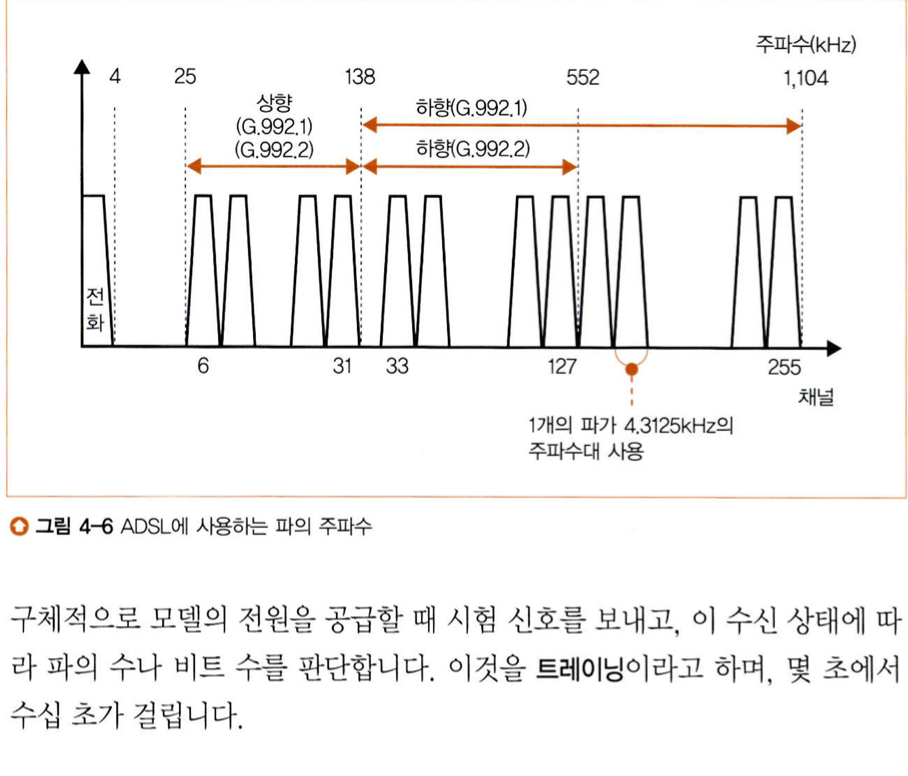 

    1. 주파수 대역을 4.3125 kHz씩 다르게 나누어 수 백 개의 파를 생성합니다.
    2. 각 파에 대해 직교 진폭 변조(QAM)를 사용하여 비트 값을 전송합니다.
    3. 잡음 등의 상태에 따라 각 파에 대응할 수 있는 비트 수가 변할 수 있습니다. 잡음이 적은 파에는 많은 비트를, 잡음이 많은 파에는 적은 비트를 대응시킵니다.
    4. 각 파에 대응시킨 비트 수를 합산하여 전체의 전송 속도가 결정됩니다.
    
    이러한 방식을 통해 **여러 주파수 대역을 사용하고, 각 주파수 대역마다 다양한 비트 수를 할당함으로써 효율적인 데이터 전송을 실현**하는 것이 QAM의 핵심 아이디어입니다. "잡음이 없는 주파수 대역에서는 많은 비트를 전송하고, 잡음이 있는 주파수 대역에서는 적은 비트를 전송한다"는 원리를 통해 데이터 전송 속도와 신호 품질을 최적화할 수 있습니다.
    
    **다양한 주파수 대역을 사용하여 서로 다른 데이터 스트림을 동시에 전송**합니다. 이 때 각 주파수 대역마다 다른 데이터를 전송하게 됩니다.
    

1. ADSL의 다운로드와 업로드 방향의 전송속도는 왜 다를까?
    
    여러 개의 **파에 대응시킨 비트 수를 합산하여 전체의 전송 속도가 결정된다**. 각 주파수 대역마다 할당된 비트 수가 다르게 조정되면, 해당 주파수 대역을 통해 전송되는 **데이터의 양이 결정되며, 이로써 전체 데이터 전송 속도가 결정**됩니다.
    
    업로드 방향은 보통 다운로드 방향보다 적은 파를 사용하여 전송 속도를 제한하고, 다운로드 방향은 많은 수의 파를 사용하여 더 빠른 속도를 제공합니다.
    
    업로드 속도는 적은 수의 파를 사용하여 전송되기 때문에 대역폭이 제한되어 상대적으로 느린 속도가 됩니다. 반면, 다운로드 속도는 많은 수의 파를 사용하여 더 넓은 대역폭을 활용하여 빠른 속도를 제공합니다. 따라서 업로드와 다운로드의 속도 차이는 주로 사용되는 파의 수의 차이에 기인한다.
    

1. ADSL은 회선의 상태를 조사해, 사용할 파의 수나 각 파에 대응하는 비트 수를 판단하는 구조로 되어있다.
    
    다운로드에 사용하는 **높은 주파수의 파는 감쇠가 크고 잡음의 영향을 받기 쉬우므로 적은 비트 수만 지원하거나 전혀 사용할 수 없는 경우가 있**다.
    거리가 멀어질수록, 주파수가 높아질수록 이러한 경향은 강해지기 때문에 전화국에서 멀어지면 속도가 떨어지는것이다.
    
    1. **트레이닝 (Training):** ADSL 모뎀은 초기에 전송할 신호를 보내 회선의 상태를 확인합니다. 
        
        이 **초기 테스트를 통해 회선의 손실, 잡음, 감쇠 등의 특성을 평가**합니다.
        
    2. **파의 수와 비트 수 결정:** 트레이닝 과정에서 얻은 회선의 정보를 기반으로 **ADSL 모뎀은 사용할 파의 수와 각 파에 대응하는 비트 수를 결정**합니다. 이는 회선의 특성에 맞게 최적화된 설정을 찾는 과정입니다.
    3. **동적 조정:** 회선의 상태가 변화할 때마다 ADSL 모뎀은 이를 감지하고 파의 수와 비트 수 등을 동적으로 조정하여 최적의 전송 성능을 유지하려고 시도합니다.
    4. **재조정 및 유지:** 회선의 상태 변화에 따라 필요에 따라 주기적으로 트레이닝을 반복하며, 최적의 전송 성능을 유지하려고 노력합니다.
    
    이러한 동적인 파라미터 조정을 통해 ADSL 시스템은 다양한 환경에서 최상의 전송 성능을 제공하며, 회선의 품질 변화에 대응하여 안정적인 통신을 지원합니다.
        
    
---

## 6. 스플리터의 역할

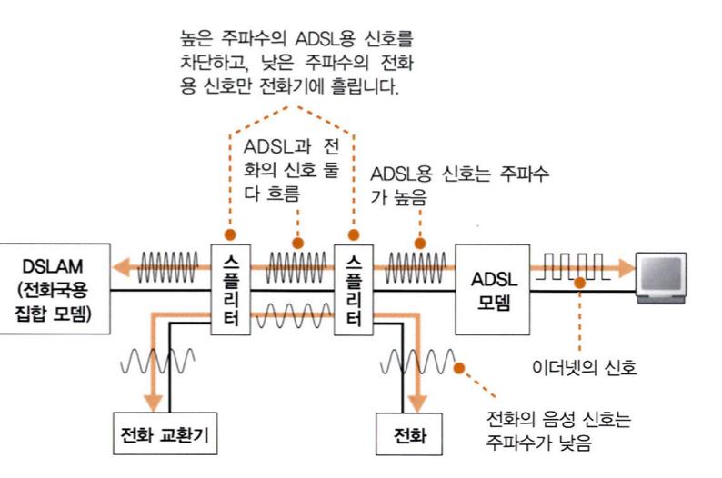 

1. ADSL 모뎀은 **전기 신호로 변환된 데이터를 전화 회선으로 보내기 위해 스플리터라는 장치를 사용**합니다.

   이때 ADSL의 신호는 **전화의 음성 신호와 섞여서 전화 회선으로 흘러나갑니다**.

   사용자가 전화를 걸 때는 전화와 ADSL의 신호를 그대로 전송하며, 스플리터는 특별한 조치를 취하지 않는다.

2. 스플리터의 역할
   반대로 **전화 회선에서 신호가 들어온 경우**입니다. 전화 음성 신호와 ADSL의 신호가 혼합되어 들어오므로, **이를 분리하여 전화기에는 전화의 신호만 흘리고, ADSL의 신호가 전화음성을 방해하지 않도록 하는 것**이 스플리터의 역할이다.

   스플리터는 특정 주파수 이상의 신호를 차단하는 기능을 가지고 있어서, **ADSL의 높은 주파수 신호를 차단하며 전화기 측으로 전달되는 신호에는 영향을 주지 않도록 합니다.**

   **스플리터를 통해 전화기 측으로 들어가는 고주파수 신호를 차단함으로써, 전화기에서는 전화 음성만 들리게 되고 ADSL의 신호는 전달되지 않습니다**.

3. ADSL 모뎀은 **내부적으로 사용하지 않는 주파수를 차단하는 기능을 갖추고 있기 때문에 스플리터가 필요하지 않습니다**.

   = 범위를 벗어나는 주파수를 차단해,전화의 음성신호와 ADSL의 데이터 신호가 서로 영향 안가게 함

   = 전화의 신호와 ADSL의 신호가 함께 전달될 때 발생할 수 있는 문제를 해결함

4. 스플리터의 역할은 ADSL의 신호가 전화기 측으로 흐르지 않도록 방지하는 것뿐만 아니라,
   **전화기 측에서 전화와 ADSL의 신호가 충돌하여 문제가 발생하는 것을 막는 역할**도 합니다. 이러한 역할로 인해 전화와 ADSL 간의 영향을 방지하여 원활한 통신을 유지할 수 있습니다.

   예)  **전화 음성과 ADSL 데이터의 충돌:** 전화 음성과 ADSL 데이터 통신이 동시에 이루어지면, **전화 음성의 주파수 범위와 ADSL 데이터의 주파수 범위가 겹치게 될 수 있고**. 이 때 두 신호가 겹치게 되면, 전화 통화의 음질 저하나 데이터 통신의 문제가 발생할 수 있음.

   예) **전화 신호의 영향:** 전화가 오거나 전화를 걸 때, 전화 음성 신호가 전화 회선을 통해 전달되는데. 이 때 만약 **전화 음성 신호와 ADSL 데이터 신호가 충돌한다면, 데이터 신호의 영향으로 전화 통화 품질이 저하.**

### 정리

전화 회선과 ADSL의 신호는 같은 물리적인 회선을 공유한다.

스플리터는 **전화 회선으로 들어오는 신호를 전화기와 ADSL 모뎀으로 물리적으로 분리하여 전달하는 역할**을 합니다. **전화 음성 신호는 스플리터를 통해 전화기로 전달되고, ADSL의 데이터 신호는 스플리터를 통해 ADSL 모뎀으로 전달**됩니다. 이로써 전화 음성과 ADSL의 데이터 신호가 서로 영향을 주지 않고 각각의 장치로 전달되어 안정적인 통신이 가능하게 됩니다.

스플리터는 전화기 측에 흐르는 높은 주파수 신호를 차단하므로, ADSL이 전화기에 끼치는 영향을 방지하기 위해 사용하는 것으로 생각하기 쉬우나, 전화기가 ADSL측에 끼치는 영향을 방 한.

---

## 7. 전화국까지의 여정

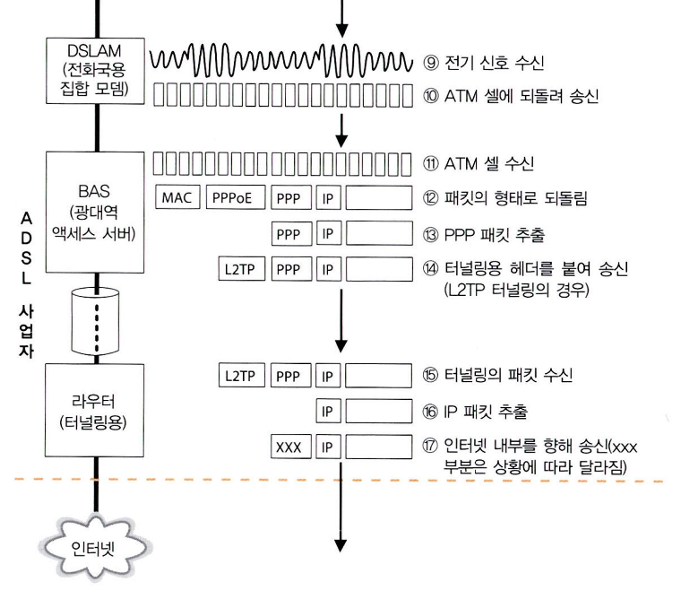 

1. 전화회선이 건물 내부에서 외부로 나가는 과정

   전주의 전화 케이블 : 외부에서 건물로 들어오는 전화 회선의 케이블

   ← IDF(중간배선반), MDF(주배선반) : 건물 내부에서 외부와 연결하고 배선을 관리하며 전화 회선을 분배하는 중요한 장치

   ←옥내 배선: 건물 내부에서 전화 회선이 이동하는 배선

   ← **전화 케이블 꽂은 모듈형 커넥터 : 옥내 배선을 외부로 연결하기 위한 커넥터**

   **←스플리터 : 전화회선의 ADSL신호와 전화신호 분리하는 장치**

   IDF(IDentification Frame)를 통해 전화의 옥내 배선이 건물 내부에서 외부로 나가게 됩니다.
   특히, 건물 등의 경우에는 해당 건물 내에서 IDF나 MDF(Main Distribution Frame)와 같은 중요한 장치가 있습니다. IDF나 MDF는 **배선이 모이는 중요한 지점이며, 건물 내부의 배선과 외부의 배선이 연결되어 전화 서비스가 제공**된다.

2. 전화 케이블의 신호 전달

   IDF나 MDF을 지나면 신호는 전주의 전화 케이블로 들어간다.

3. 전화 케이블의 경로

   전화케이블은 사용자와 가까운 곳에는 전주(전선이나 통신선을 늘여 매기 위하여 세운 기둥)에 부착되어 있지만, 도중에는 전주의 둘레에 굵은 금속 파이프로 묶여서 지하로 이어지는 과정을 거칩니다. **이 지하로 들어가는 부분을 "궤선점(Ft)**"이라고 합니다. 전화케이블은 주택이나 건물마다 설치되어 있으며, 전화국에 가까워질수록 많은 수의 케이블이 모이게 됩니다.

4. 전화 회선의 구조와 설치 과정

   전화국과의 연결은 **모든 케이블을 전주로 직접 연결하는 것은 현실적으로 어렵다**, 대량의 케이블을 전주로 집중시키는 것 또한 문제가 될 수 있다고 언급합니다. 따라서 **전화국 주변에서 지하로 케이블을 매설**하게 된다. **전화국과 가까워질수록 지하 케이블의 수가 증가하므로, 이러한 지하 케이블을 모아서 매설하는 부분을 "동도(Ft)"라고 부다**. 이 동도를 통해 전화국에 들어간 **케이블은 전화국의 MDF에 하나씩 연결**되게 됩니다.

### MDF란?

"Main Distribution Frame"의 약자로, **전화국이나 건물 내에서 전화 회선을 관리하고 분배하는 주요 배선반**을 말합니다. MDF는 전화국 내부에서 **다양한 전화 회선을 관리하고 연결하기 위한 중심적인 장치**로 사용된다.

---

## 8. 잡음의 영향

전화케이블을 통과하는 신호는 여러 가지 잡음의 영향을 받을 수 있다.

== 이더넷의 트위스트케이블과도 유사한 점.

- 잡음은, 전화케이블의 외부에서 들어오는 잡음이나 내부에서 발생하는 크로스토크 등이다.

  이로 인해 신호선에서 전자파가 누설되어 신호가 변형되는 경우가 발생할 수 있습니다.

- **특히 ADSL은 높은 주파수를 사용하므로, 주파수가 겹치는 신호와 잡음이 영향**을 줄 수도 있다.

  이유 : ADSL은 고속 인터넷 접속을 위해 **다양한 주파수 대역을 사용**합니다. 이러한 주파수 대역은 신호의 전달과 데이터 송수신을 위한 다양한 정보를 분할하여 전송하는데 사용됩니다. **하지만 여러 개의 주파수 대역을 사용하다보면, 다른 통신이나 잡음으로 인해 주파수가 겹칠 수 있다.**

- 트위스트페어케이블과 전화케이블의 영향을 비교하면, **트위스트페어케이블은 하나의 사각형 신호만 흐르기 때문에 변형된 신호는 오류를 발생**시킵니다. (사각형 신호= 변형된 신호 발생하면 데이터 손실이나 오류)
- 반면 **ADSL에서는 다수의 주파수로 분할되어 있어서 변형된 신호가 발생하더라도 즉시 오류가 발생하지 않습니다. 대신에 신호가 손실되거나 왜곡될 가능성이 높아지며, 이에 따라 데이터의 품질이 저하된다.**

[외부의 잡음]

- **각종 잡음이 전화케이블에 영향을 주는데 속도가 저하되는 이유**
    - **신호 왜곡과 왜곡 보정**: 신호 왜곡이 발생하면 신호가 제대로 해석되지 않아 **수신 측에서 오류가 발생**. **이러한 왜곡을 보정하려면 복잡한 디지털 신호 처리 기술이 필요하며, 이로 인해 데이터의 전송 속도가 저하**
    - **신호 간 간섭**: 잡음이나 다른 주파수의 신호와 겹치면서 신호 간 간섭이 발생할 수 있습니다. ADSL은 여러 주파수 대역을 동시에 사용하므로, 다른 신호와의 간섭이나 겹침이 발생할 경우 **데이터 패킷의 오류나 재전송을 유발해, 전송속도가 저하된다**

[내부에서 발생하는 잡음]

- 인접한 서브유닛의 가까운 위치에 ADSL의 신호선과 ISDN 회선의 신호선이 함께 있는 경우, ISDN 회선에서 발생하는 잡음에 영향을 받을 수 있습니다. 초기에는 이러한 영향을 방지하는 기술이 주목받았지만, 현재는 이러한 영향을 방지하는 기술이 확립되어 걱정하지 않고 이용할 수 있게 되었습니다.

  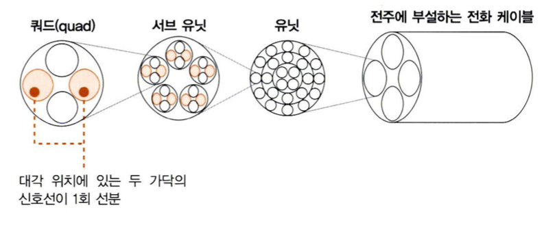

---

## 9. DSLAM을 통과해 BAS에 도달한다

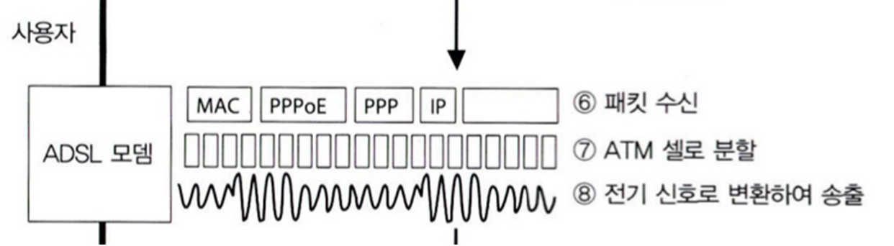 

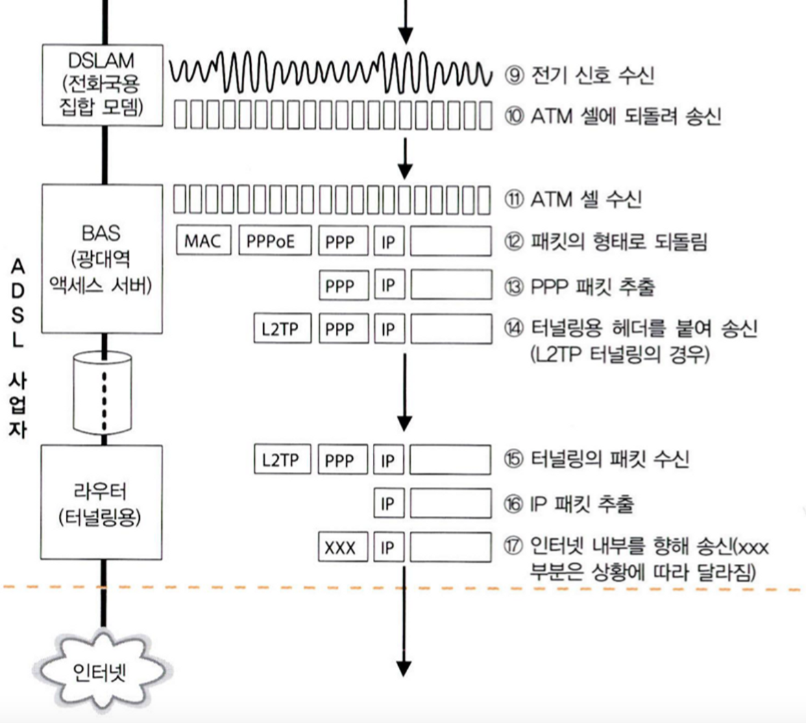 

1. **전화 케이블을 통한 ADSL 신호 도착**: ADSL 신호는 전화 케이블을 통해 전화국에 도착합니다.
   이 신호는 배선반과 스플리터를 거치며 DSLAM(Digital Subscriber Line Access Multiplexer)까지 전달됩니다.
2. **DSLAM에 도착**: 스플리터로 분기된 ADSL 신호는 DSLAM(Digital Subscriber Line Access Multiplexer)까지 전달됩니다. DSLAM은 전화 국에 설치된 장치로, **ADSL 신호를 디지털 데이터로 변환하고 관리**다.
3. **DSLAM 처리**: DSLAM에 도착한 신호는 ADSL 모뎀의 역할과 유사한 역할을 수행하는 장치에 넣어지며, **어떤 비트 값에 해당하는지 조사하여 디지털 데이터로 변환된**다.
    - **DSLAM과 사용자 측 ADSL 모뎀의 수신 동작 비교**: 이 변환 동작은 사용자 측 ADSL 모뎀의 수신 동작과 유사한 역할을 합니다. 따라서 전화국에서 여러 대의 ADSL 모뎀을 설치해도 유사한 역할을 수행할 수 있습니다. 다만 여러 대를 설치하면 공간 차지와 모니터링이 어려움. 여러대의 모뎀을 하나의 DSLAM으로 관리하는 것이다.
4. **DSLAM에서 나온 신호의 처리**: DSLAM에서 **변환된 데이터는 BAS(Packet Relay Device)에 도착**합니다. 이 장치도 ATM 인터페이스를 가지며, 신호를 **셀로 분할한 데이터를 수신**합니다.
5. **BAS의 처리**: BAS는 **수신한 셀로부터 원래의 패킷을 복원하는 역할**을 합니다. ATM 인터페이스를 통해 셀로부터 **패킷을 추출하고, MAC 헤더와 PPPoE 헤더를 제거한 후 데이터를 추출**합니다.
6. **터널링 용 헤더 추가**: BAS에서 추출한 패킷은 **터널링을 위한 헤더를 추가하여 인터넷 출구로 전달**됩니다.
7. **터널링용 라우터 처리**: 추가된 **터널링용 헤더를 분리하고 IP 패킷을 추출하여 인터넷 내부로 중계**됩니다

이러한 과정을 통해 ADSL 회선에서 데이터가 사용자의 컴퓨터 또는 기기로 전달되고, 사용자와 인터넷 간의 통신이 이루어지게 된다.

---
### BAS란???????????????????????

"Broadband Access Server"의 약자로, "광대역 접속 서버". BAS는 **네트워크에서 사용자들의 접속을 관리하고 제어하는 장치**입니다. 주로 광대역 서비스와 관련이 있으며, **사용자의 데이터 패킷을 처리하고 전달하는 역할**을 수행합니다.

특히 **ADSL과 같은 광대역 서비스에서 BAS는 수신한 셀로부터 원래의 패킷을 복원하고, 터널링용 헤더를 추가한 후 인터넷 내부로 중계하는 등의 역할을 수행**합니다. 이를 통해 **사용자들이 빠르고 안정적으로 광대역 인터넷을 이용할 수 있도록 지원**합니다.

### 터널링이란??????????????????????

컴퓨터 네트워크에서 데이터를 한 프로토콜에서 다른 프로토콜로 전송하는 기술을 말합니다. 이는 **서로 다른 네트워크나 프로토콜 간의 통신을 가능하게 하기 위한 방법 중 하나**입니다.

일반적으로 네트워크 통신에서 데이터 패킷은 특정 프로토콜을 사용하여 전송되며, 이는 해당 프로토콜의 규칙과 형식을 따릅니다. 하지만 **서로 다른 두 개의 네트워크가 서로 다른 프로토콜을 사용할 경우, 데이터 통신을 위해서는 이를 어떻게 처리해야 할지 문제가 발생**합니다.

**이때 터널링이 사용됩니다. 터널링은 데이터 패킷을 원래의 프로토콜 형식을 유지하면서, 다른 프로토콜을 사용하는 네트워크로 전송하는 방법**입니다. 데이터 패킷을 터널링하는 과정에서 패킷의 헤더나 추가 정보가 변경되지 않도록 보장하며, 데이터의 안정성과 보안을 유지합니다.
