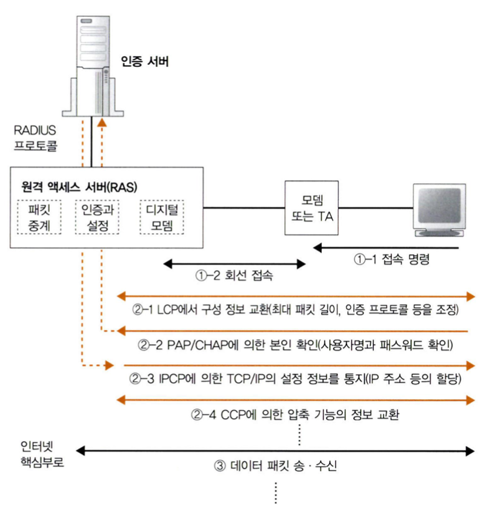
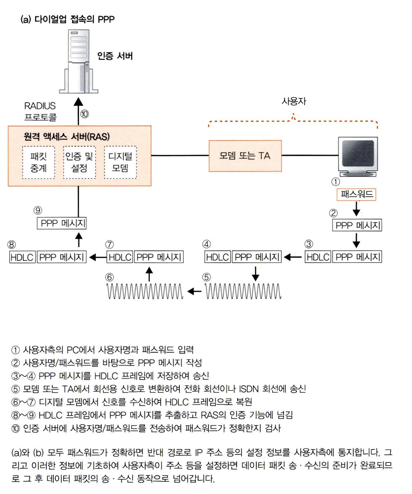
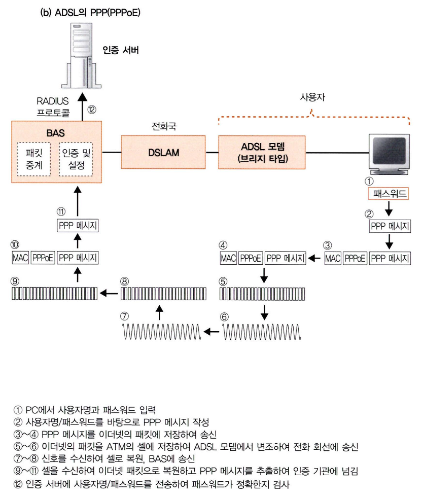
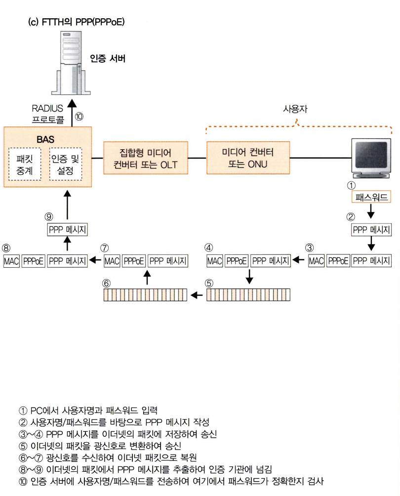
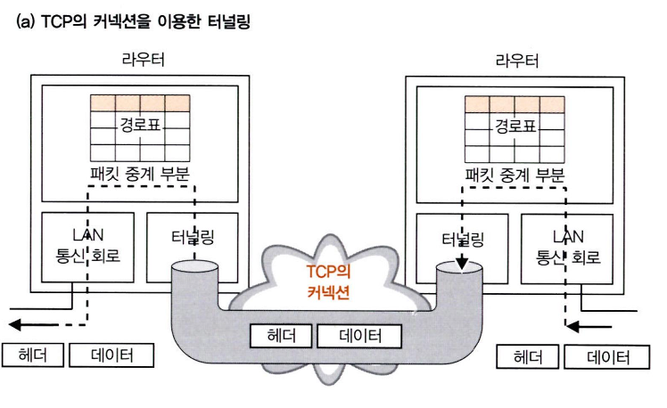
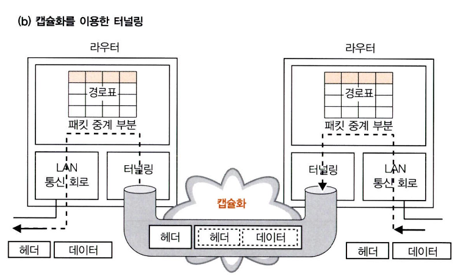
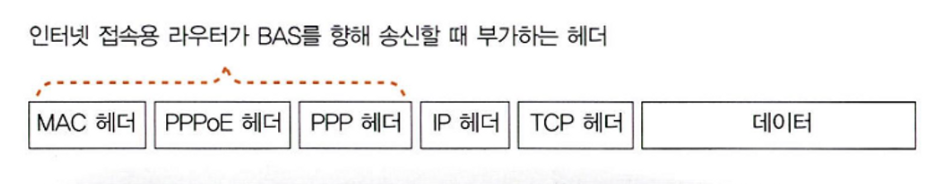
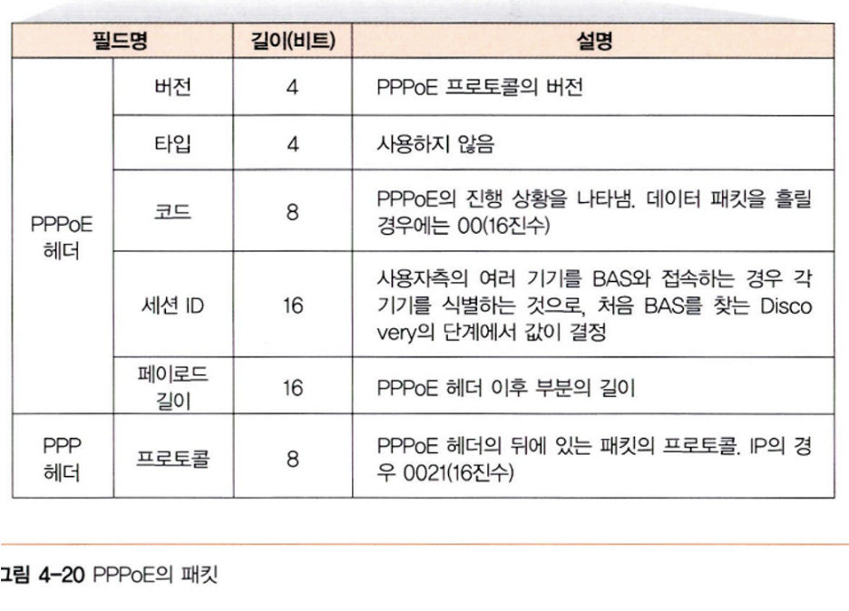

# story 3 : 액세스 회선으로 이용하는 PPP와 터널링

## 1. 본인 확인과 설정 정보를 통지한다

### BAS란???????????????????????

"Broadband Access Server"의 약자로, "광대역 접속 서버". BAS는 **네트워크에서 사용자들의 접속을 관리하고 제어하는 장치**입니다. 주로 광대역 서비스와 관련이 있으며, **사용자의 데이터 패킷을 처리하고 전달하는 역할**을 수행합니다.

특히 **ADSL과 같은 광대역 서비스에서 BAS는 수신한 셀로부터 원래의 패킷을 복원하고, 터널링용 헤더를 추가한 후 인터넷 내부로 중계하는 등의 역할을 수행**합니다. 이를 통해 **사용자들이 빠르고 안정적으로 광대역 인터넷을 이용할 수 있도록 지원**합니다.

액세스 회선에 서 인터넷 향해 흘러온 패킷은 액세스 회선 운영하는 사업자가 소유한 BAS에 도착한다

인터넷은 다수의 라우터를 함께 연결하여 만든것으로, 액세스 회선을 라우터에 연결하는 것이 원칙.

액세스 회선이 asdl이나 ftth로 진화한 것에 맞게 회선을 연결하는 라우터도 진화한 것이 bas

1. ADSL이나 FTTH 액세스 회선에서 **인터넷으로 흘러오는 패킷은 해당 액세스 회선을 운영하는 사업자의 BAS(이어지는 네트워크로의 입구 장치)**에 도착한다.
2. 인터넷은 원래 여러 개의 라우터를 연결해 만들어지며, 액세스 회선을 라우터에 연결하는 것이 기본 원칙이다.

   **액세스 회선이 ADSL이나 FTTH로 발전하면서 이에 맞춰 액세스 회선을 연결하는 라우터 역시 진화**하게 되었는데, **이것이 바로 BAS**.

3. BAS가 진화한 내용은 **본인 확인과 설정정보 통지 기능**.

   ADSL이나 FTTH의 **액세스 회선을 사용하려면 처음에 사용자가 사용자명과 패스워드를 입력하여 로그인을 해야 인터넷에 접속할 수 있다**.

   이때 **BAS는 사용자의 로그인 동작을 수행하는 창구 역할**을 하게 됨.

   이를 위해 **PPPoE(PPP over Ethernet)라는 구조를 사용**.

4. PPPoE는 전화 회선이나 ISDN과 같은 **다이얼업 방식으로 인터넷에 접속할 때 사용하는 프로토콜인 PPP를 발전시킨 것**입니다.
    - **다이얼업 접속:** 사용자가 프로바이더의 액세스 포인트에 전화를 걸어 연결하고, 사용자명과 패스워드를 입력하여 로그인하는 방식이다.
    - PPPoE 구조 : Point-to-Point Protocol over Ethernet의 약자로, **이더넷 프레임을 사용**하여 PPP 프로토콜을 통해 **사용자의 컴퓨터와 인터넷 서비스 제공자의 네트워크 간에 인증과 데이터 전송을 처리하는 방식**
        1. 사용자명과 패스워드는 **RADIUS 프로토콜을 사용하여 RAS에서 본인 확인용 서버에 전송되고, 이 서버에서 정확성을 검사**.
        2. 패스워드가 확인되면 **인증 서버에서 IP 주소 등의 설정 정보를 반환하고, 사용자 측으로 전송.**
        3. 사용자의 PC는 이 정보를 바탕으로 IP 주소 등의 설정을 수행하고, 인터넷 통신을 위한 TCP/IP 패킷 송수신 준비. 이후 패킷 송수신 동작한다.

### PPP 프로토콜이란?

: PPP(Point-to-Point Protocol)은 **컴퓨터 네트워크 장치 사이에서 연결을 위한 데이터 링크 계층 프로토콜**.

- 사용자의 컴퓨터나 장치가 **인터넷 서비스 제공자의 서버와 연결하여 통신할 수 있도록** 해줌
- 다이얼업 접속 이외에도 시리얼 라인, ISDN, DSL, 케이블 모뎀 등 다양한 통신 매체를 통해 연결할 수 있음.
- **일반적으로 사용자가 인터넷 서비스 제공자의 네트워크에 접속할 때 사용됨.**

### PPPoE란?

: 다이얼업 접속과 같이 동적으로 IP 주소가 할당되어야 하는 경우에 활용

### PPPoE의 핵심은

**인터넷에 접속할 때는 PC에 글로벌 주소를 설정해야 하는데, 다이얼업 접속은 전화번호에 따라 액세스 포인트가 바뀔 수 있기 때문에 주소를 사전에 고정할 수 없다**.

따라서 **접속 시 인터넷 측에서 PC에 TCP/IP 설정 정보를 알려주고**, 그중에 포함된 글로벌 주소를 PC에 설정하는 것이다.

- 인터넷에 접속할 때 사용되는 IP 주소 설정시 : 다이얼업 접속과 IP 주소 설정의 관계

  다이얼업 접속은 **사용자가 전화선이나 모뎀을 통해 인터넷 서비스 제공자의 서버에 접속하는 방식**을 의미.

  사용자가 전화를 거는 순간에는 **어떤 액세스 포인트(서버)를 통해 연결될지** 확실하지 않을 수 있다.

  예를 들어, 사용자가 다른 지역에 있는 다른 액세스 포인트를 사용하거나, 네트워크 혼잡 상태에 따라 다른 액세스 포인트로 연결될 수 있습니다.

- 이런 **다이얼업 접속의 특성으로 인해 사용자가 인터넷에 접속할 때마다 사용되는 IP 주소가 바뀔 수 있다**.
- 이는 예전에 주로 사용되었던 인터넷 접속 방식 중 하나로, 현재는 고속 브로드밴드 기술의 발전으로 대부분의 가정 및 사무실에서는 다이얼업 접속 대신에 DSL, 케이블, 광섬유와 같은 브로드밴드 접속 방식을 사용한다

즉, **다이얼업 접속을 사용하는 경우, 사용자의 PC는 인터넷에 접속할 때마다 인터넷 서비스 제공자로부터 동적으로 IP 주소를 할당**받는다. 이 동적 IP 주소 할당은 **사용자의 위치나 네트워크 상태에 따라 유연하게** 이루어지며, **각각의 다이얼업 접속 시마다 다른 IP 주소를 사용하게 된다**.

따라서,

1. 사용자가 ADSL이나 FTTH와 같은 액세스 회선을 통해 인터넷에 접속하려고 시도합니다.
2. 이때 사용자의 PC는 인터넷 서비스 제공자의 서버 또는 장비에 접속하고 로그인을 시도합니다.
3. **로그인이 성공하면, 서버 또는 장비는 사용자의 PC에게 TCP/IP 설정 정보를 제공**합니다. **이 정보에는 IP 주소, 서브넷 마스크, 게이트웨이 주소 등이 포함**됩니다.
4. **사용자의 PC는 받은 TCP/IP 설정 정보를 바탕으로 자신의 네트워크 설정을 업데이트**합니다. 이때 중요한 것은 "**글로벌 주소(Global Address)**"입니다. 이 주소는 인터넷에서 사용 가능한 유일한 주소로, 사용자의 PC가 인터넷을 통해 다른 기기와 통신할 수 있도록 합니다.
5. 이제 사용자의 PC는 업데이트된 네트워크 설정을 사용하여 인터넷을 통해 데이터를 주고받을 수 있게 됩니다.

요약하자면, **인터넷 서비스 제공자는 사용자가 인터넷에 접속할 때 필요한 네트워크 설정 정보를 제공**하며, 이 정보를 기반으로 사용자의 PC는 인터넷과 통신할 수 있는 환경을 설정합니다. 그 중에서도 **"글로벌 주소"는 인터넷 상에서 사용자의 PC를 식별하고 찾아올 수 있는 주소로, 데이터 통신을 위해 중요한 역할**을 합니다.

### PPPoE의 장점 정리

PPPoE는 동적으로 IP 주소를 할당받을 수 있으면서도, **해당 접속 세션 동안 일정한 글로벌 IP 주소를 사용할 수 있는 장점**을 가지고 있습니다. 이는 **사용자가 인터넷을 사용하는 동안 일관된 식별 가능한 IP 주소를 사용할 수 있게 해주므로, 인터넷 서비스를 용이하게 만들어 줍니다**.

   

---

## 2. 이더넷에서 PPP 메시지를 주고받는 PPPoE

1. **인터넷 접속 및 주소 설정**
   : ADSL이나 FTTH와 같은 액세스 회선에서도 **인터넷에 접속하기 위해서는** **PC에 글로벌 주소를 설정**해야하는데. ADSL이나 FTTH는 **사용자가 BAS와 케이블로 직접 접속하여 본인을 확인하므로 별도의 인증 절차가 필요하지 않다**. 즉, 반드시 PPP의 구조가 필요한 것은 아니다.
   - 사용자는 자신의 장치를 사용하여 네트워크에 연결하고 인터넷 서비스를 시작하면, 해당 네트워크의 BAS에게 사용자명과 패스워드 등의 정보를 제공하여 본인을 확인. 이 인증 과정을 통해 BAS는 사용자의 신원을 확인하고, 사용자가 정당한 접속인지를 확인한 후 인터넷 서비스를 제공.
   2. **사용자 인증과 PPP 구조**:
   하지만 사용자명과 패스워드를 입력하는 동작을 남겨두면, 해당 사용자명에 따라 프로바이더를 전환할 수 있어 편리합니다. 이런 이유로 ADSL이나 FTTH에도 PPP의 구조를 사용하기로 결정되었다.
   - 사용자가 서로 다른 인터넷 서비스 제공자(프로바이더) 사이에서 선택을 할 수 있는데, 이때 각각의 프로바이더에 맞는 사용자명과 패스워드를 입력하여 접속할 수 있다
   - 사용자명과 패스워드를 입력하는 과정을 남겨두면, 다른 프로바이더로 전환할 때마다 매번 새로운 사용자명과 패스워드를 입력하지 않아도 됨. 이미 입력한 정보를 사용하여 원하는 프로바이더에 접속하고 서비스를 이용할 수 있기 때문
   3. **PPP 메시지와 HDLC**:

   PPP 프로토콜에는이더넷의 프리앰블이나 FCS에 해당하는 규정이나 신호에 대한 규정이 없으므로 PPP 메시지를 그대로 신호로 변환하여 송신할 수 없음. 송신 할 때는 프리앰블이나 FCS 및 신호에 대한 규정을 가진 ' 그릇'을 준비하고, 여기에 PPP메시지를 저장해야 함. 그래서 PPP는 이 그릇으로 HDLC라는 프로토콜의 사양을 차용하기로했다.

    - PPP 프로토콜이 데이터를 전송하는 과정에서 HDLC(High-Level Data Link Control) 프로토콜과 비슷한 방식을 사용한다는 것
    - 데이터 링크 계층의 프레임 전송 방식은 **데이터를 일정한 크기의 프레임 단위로 나누어서 전송**하는 것입니다. HDLC와 PPP 모두 이러한 프레임 전송 방식을 사용하며, **각각의 프레임에는 데이터를 식별하는 정보와 오류 검출을 위한 체크섬 등의 제어 정보가 포함**됩니다. 또한 프레임의 시작과 끝을 나타내는 특정 패턴을 사용하여 동기화를 유지합니다.

      따라서 "HDLC와 유사한 구조를 사용하여 PPP 메시지를 전송한다"는 말은 **PPP 프로토콜이 데이터 전송 시 HDLC와 비슷한 프레임 구조와 제어 방식을 사용하여 데이터를 송수신한다는 것**을 의미.

    - 그림 (a)와 같은 상태로 PPP메시지를 운반한다
4. **PPPoE 프로토콜**:

   ADSL이나 FTTH에서는 HDLC와 같은 그릇 대신에 **이더넷 패킷을 사용하여 PPP 메시지를 전송**하는데, 이를 PPPoE(Point-to-Point Protocol over Ethernet) 프로토콜이라고 합니다. PPPoE는 이더넷 패킷에 PPP 메시지를 넣어 전송하면 다이얼업 회선과 같이 통신할 수 있다.

---

## 3. 터널링 기능에 의해 프로바이더에 패킷을 전달한다

### BAS의 기능

- 본인 확인의 창구 역할하는 기능
- 터널링을 사용하여 패킷 운반하는 기능

### 터널링이란?

- 터널링은 소켓과 소켓 사이를 연결하는 TCP의 커넥션과 유사한 역할을 하는데, TCP 커넥션의 한 쪽 출입구(소켓)에 데이터를 넣으면 데이터가 그대로 반대쪽 출입구에 도착하는 것과 유사한 방식으로 동작한다.
- 터널링은 **데이터를 물리적인 연결 없이 안전하게 운반하고 데이터의 완전성과 신뢰성을 보장하는 역할**을 한다.

### 터널링을 사용하는 이유(효과)?

터널링을 사용하여 **BAS와 프로바이더의 라우터 사이에** 있는 ADSL/P TTH **접속 서비스 사업자의 네트워크 안에 터널을** 만들 수 있습니다.

- 사용자와 BAS를 연결하는 액세스 회선을 이 터널에 연결하면,
- 사용자로부터 프로바이더의 라우터까지 한 개의 길이 형성되어 패킷이 이 경로를 통해 인터넷의 내부로 들어가게 됩니다.
- 이렇게 함으로써 **액세스 회선이 프로바이더의 라우터까지 연장되는 효과**를 가지게 됩니다.

### 터널링을 어떻게 실현할까(방법)?

1. TCP의 커넥션을 이용하여 실현하는 방법.

   

    - 터널링용 라우터 사이에 TCP 커넥션을 만들고, 소켓을 사용하여 데이터를 주고받습니다.
    - 라우터에서 패킷을 송수신할 때에는 **터널링 규칙에 따라 패킷을 터널에 넣거나 꺼내는 방식으로 작동**.

2. 캡슐화(encapsulation) 방식

   

    - **헤더를 포함한 패킷 전체를 별도의 패킷 안에 저장하여 터널의 한쪽 출입구까지 운반**합니다.
    - 패킷은 그대로의 모습으로 반대쪽 출입구에 도착하므로, 결과적으로 TCP 커넥션을 이용하는 방법과 유사하게 패킷의 통로가 되는 터널을 실현할 수 있다.

---

## 4. 액세스 회선 전체 동작

액세스 회선의 동작은 사용자측에 인터넷 접속용 라우터를 설치하고 인터넷에 접속한 곳부터 시작된다.

1. **라우터 설정 및 PPPoE Discovery**:
    - 사용자가 인터넷 접속용 라우터에 사용자명과 패스워드를 등록하면, 인터넷 접속용 라우터는 PPPoE의 Discovery 구조를 사용하여 BAS(광대역 접속 서버)를 찾습니다.
    - 이 구조는 ARP와 유사한 방식으로 동작하며, 인터넷의 브로드캐스트를 이용합니다.
    - BAS가 응답하여 MAC 주소를 알려줍니다.
2. **사용자 인증 및 설정 값 통지**:
    - 사용자명과 패스워드를 BAS에 전송합니다. 여기서 인터넷 접속용 라우터 설정을 통해 패스워드를 암호와하는 CHAP 또는 암호화하지 않는PAP 방식을 선택합니다.
        - 암호화하지 않은 패스워드가 흐르는 곳은 BAS와 인터넷 접속용 라우터 사이 뿐이기 때문에 패스워드가 즉시 도청당하는 것은 아니다.
    - **BAS는 사용자 인증 정보를 확인하고, 사용자에 대한 TCP/IP 설정 정보를 제공**합니다.
    - TCP/IP 설정 정보에는 사용자에게 할당된 IP 주소, DNS 서버의 IP 주소, 기본 게이트웨이의 IP 주소 등이 포함됩니다.
    - 인터넷 접속용 라우터를 사용할 경우, **이 설정 정보를 인터넷 접속용 라우터가 받아서 라우터 자체에 설정**. 이렇게 인터넷 접속용 라우터의 **BAS 측 포트에 글로벌 주소가 할당**되고, **경로표에 기본 게이트웨이도 설정**됩니다. 그리고 인터넷 접속용 라우터는 패킷을 인터넷에 중계할 수 있는 상태가 된다.
3. **인터넷 패킷 송신**:
    - 사용자가 브라우저를 통해 인터넷에 접속하면 패킷이 흘러옵니다.
    - 이 패킷의 수신처는 인터넷의 어느 한 부분이므로, 인터넷 접속용 라우터의 경로표에 등록되어 있지 않기 때문에, 라우터는 기본 게이트웨이로 중계합니다.
4. **PPP 헤더 추가 및 터널링**:
    - 경로표에서 중계대상을 판단한 후 **패킷을 송신하는 부분은 보통의 인터넷이 아니라 PPPoE의 규칙에 따른 상태**가 된다

      = 인터넷 접속 정보와 관련된 추가적인 헤더를 포함하여 패킷을 송신한다. 인터넷 패킷을 라우팅하는 과정에서 일반적인 IP 프로토콜 동작과는 차이가 있음

    - PPPoE 프로토콜은 사용자가 브로드밴드 인터넷 서비스(고속 인터넷 서비스의 일종으로, 대역폭이 넓어 높은 데이터 전송 속도를 제공하는 인터넷 연결)에 접속할 때 사용되는 프로토콜로, 사용자의 컴퓨터 또는 네트워크 장치와 인터넷 서비스 제공자의 네트워크 간에 데이터 통신을 위한 프로토콜이다.
    - **인터넷 패킷이 송신될 때, PPPoE는 추가적인 헤더를 붙여서 패킷을 포장하게 됩니다. 이러한 헤더는 사용자의 인증 및 접속 정보를 담고있다. PPPoE 헤더를 패킷에 붙여 사용자 인증을 매번 거쳐야 해서**.

      따라서 PPPoE는 사용자마다의 인증과 설정 정보를 효율적으로 관리하기 위해 중계와 관련된 규칙을 적용하며, 이로 인해 중계대상을 판단한 후 패킷을 송신하는 과정이 다른 인터넷 패킷 전달과 구별되는 것입니다.

         
   
        1. 먼저 송신하는 패킷에 헤더를 붙이고, 값을 기록한다
            - MAC헤더 수신처 MAC 주소에는 PPPoE의 Discovery에서 조사한 BAS의 MAC주소를
            - 송신처 MAC 주소에는 인터넷 접속용 라우터의 BAS측 포트의 MAC주소를
            - 이더타입에는 PPPoE를 나타내는 16진수를 쓴다.
            - 중계된 패킷에 PPPoE 헤더와 PPP 헤더를 추가합니다.

              이 두 헤더에는 사전에 결정된 값들이 포함되어 있습니다.

              

    1. 패킷은 BAS에 도착하면 MAC 헤더와 PPPoE 헤더를 제거하고, PPP 헤더 이후의 부분을 추출합니다.
    2. 터널링의 원리를 사용하여 패킷을 프로바이더의 라우터로 송신합니다.

5. **프로바이더 라우터에서 패킷 처리**:

   프로바이더의 라우터는 패킷을 처리하고 인터넷으로 전달합니다.

### 정리

인터넷 접속용 라우터를 통해 사용자 인증과 설정 정보 획득이 이뤄지며, 인터넷 패킷은 중계를 통해 프로바이더의 라우터까지 전달됩니다. 이 과정에서 PPPoE와 터널링을 이용하여 안전하고 신뢰성 있는 데이터 전송이 이루어집니다.

---

### 가정용 공유기는 PPPoE프로토콜을 사용해서 브로드밴드 인터넷 서비스에 접속한다.

PPPoE 프로토콜은, **이더넷 네트워크를 통해 사용자 장치와 인터넷 서비스 제공자의 네트워크 간에 인증 및 연결을 설정하는 데 사용된**다. BAS는 사용자 인증 정보를 확인하고 TCP/IP 설정 정보를 제공하며, 사용자와 인터넷 서비스 제공자 간의 중간 단계 역할을 한다.

가정용 공유기는 다음과 같은 프로세스를 통해 인터넷에 접속:

1. **PPPoE 인증 설정**: 사용자는 공유기 설정에서 PPPoE 인증 정보(사용자명과 패스워드)를 입력.
2. **BAS 검색 및 연결**: 공유기는 PPPoE Discovery 프로세스를 통해 BAS(광대역 접속 서버)를 찾는다. 이를 통해 인터넷 서비스 제공자의 네트워크와 연결.
3. **사용자 인증 및 IP 할당**: BAS는 사용자 인증 정보를 확인하고, 해당 사용자에게 IP 주소 및 네트워크 설정 정보를 할당.
4. **인터넷 사용**: 공유기는 할당된 IP 주소와 설정 정보를 기반으로 인터넷에 연결되며, 가정 내부의 다양한 장치들이 해당 공유기를 통해 인터넷을 사용할 수 있다.

### 가정용 공유기는 인터넷을 사용하는 동안 PPPoE 헤더를 패킷에 붙여 사용자 인증을 매번 거쳐야한다.

PPPoE는 사용자 인증 및 연결을 위한 프로토콜로, **인터넷 접속이 확립되면 계속해서 사용자의 장치(가정용 공유기)와 인터넷 서비스 제공자 간의 통신을 관리**한다.

**PPPoE 헤더는 사용자 인증 및 세션을 식별하는 데 사용되며, 매번 데이터 패킷에 이 헤더가 붙게 된다**.

따라서 데이터가 사용자와 인터넷 서비스 제공자 간에 오가는 동안 PPPoE 헤더가 함께 전송되어야 한다.

**패킷이 브로드밴드 인터넷 서비스 제공자의 네트워크를 통해 안전하게 전달되고 사용자가 인터넷 서비스를 정상적으로 이용할 수 있도록 보장한**다.

### 가정용 공유기는 동적 IP주소 할당을 사용한다.

동적 IP 주소 할당은 인터넷 서비스 제공자(ISP)로부터 임시적으로 IP 주소를 할당받아 사용하는 방식.

사용자가 인터넷 서비스에 연결하면 가정용 공유기가 ISP로부터 동적으로 IP 주소를 받아서 사용자들에게 내부 네트워크에서 제공합니다. 이런 방식을 사용하면 ISP가 가지고 있는 IP 주소를 효율적으로 관리하고 할당한다.

고정 IP 주소는 항상 같은 IP 주소를 사용하는 방식입니다. 이는 주로 서버 호스팅이나 특정한 네트워크 요구 사항이 있는 기업용 서비스에서 사용되는 것이다.

---

## 5. IP 주소를 할당하지 않는 언넘버드

### 1대 1 접속이란?

인터넷 접속용 라우터가 패킷을 송신할 때 부가하는 헤더의 값은 사전에 대부분 결정되어 있어서

**경로표의 기본 게이트 항목에 어떤 값이 들어와도 관계가 없다.**

즉, 라우터 포트끼리(인터넷 접속용 라우터 - 프로바이더의 라우터) 하나의 케이블로 연결되어 있는 상태에서, 한쪽에서 송신한 패킷은 예외없이 반대편에 도착하므로,

**경로표에서 게이트웨이 항목의 값을 바탕으로 중계대상의 주소를 조사하는 동작이 필요없다**

= 게이트웨이 항목에 주소 기록할 필요 없음

= 라우터 포트에 IP주소를 할당할 필요도 없다

### 언 넘버드

글로벌 주소가 부족해져서, 1대1 형태로 접속되어있는 포트에는 IP주소를 할당하지 않아도 상관 없어졌다.

⇒ 언넘버드 : 1대1형태로 접속된 포트에 IP 주소를 할당하지 않아도 좋다는 특례.

BAS에서 설정 정보를 통지하므로 기본 게이트 웨이의 IP주소를 통지 하지 않는다.

### 정리

일반적으로 라우터나 스위치와 같은 네트워크 장비들은 IP 주소를 가지고 있어서 상호간에 통신이 가능다. 그러나 1:1로 연결되는 상황에서는 두 장비 간에 직접적인 통신이 이루어지므로 IP 주소 할당이 필요하지 않을 수 있다. 이럴 때 언넘버드라는 개념이 사용된다.

예를 들어, 가정용 공유기에서는 사용자의 개별 디바이스마다 IP 주소를 할당하는 것보다 내부 네트워크에서 관리되는 IP 주소 범위를 사용하여 디바이스들 간의 통신을 관리한다. 외부와의 통신을 위해 가정용 공유기는 고정된 IP 주소를 사용하고, 내부 디바이스들은 언넘버드로 설정되어 별도의 IP 주소 할당이 필요 없게된다.

이렇게 함으로써 IP 주소 부족 문제를 완화하고 내부 네트워크에서 관리되는 IP 주소를 더 효율적으로 활용할 수 있다.

*참고로,

인터넷 접속용 라우터가 BAS(Broadband Access Server)를 통해 프로바이더 라우터와 통신할 때, PPPoE 프로토콜이 사용되는데, 이 과정에서 패킷을 송신할 때 헤더에 PPPoE 헤더를 추가하여 사용자 인증을 거치게 됨. , 사용자가 인터넷 서비스에 접속할 때마다 매번 사용자 인증을 수행해야 한다.

언넘버드(Unnumbered) 개념은 이러한 상황과는 관련이 없다.

---

## 6. 인터넷 접속용 라우터에서 프라이빗 주소를 글로벌 주소로 변환한다

### PC에는 글로벌 주소를 할당할 수 없다 : **BAS로부터 받은 설정 정보와 주소 변환**

- BAS는 사용자 측에 TCP/IP 설정정보를 통지한다. 이 설정정보를 PC에 설정하면 글로벌 주소가 할당되어 주소변환의 원리를 사용하지 않고 인터넷에 액세스할 수 있다.
- 그러나, 인터넷 접속용 라우터를 사용하면, BAS가 통지한 설정정보를 라우터가 받아버려서 글로벌 주소는 라우터에 할당되어 버린다.
- 이렇게 하면 라우터는 내부 네트워크의 주소를 관리하고 패킷을 중계할 때 주소 변환 기능을 수행한다.

### PC에는 프라이빗 주소를 할당한다

- 사용자의 PC는 라우터에 연결되며, 이 때 라우터는 프라이빗 IP 주소를 PC에 할당합니다.
- PC가 외부로 패킷을 보내려면, 라우터는 패킷의 출발지 주소를 자신의 글로벌 주소로 변환한다. 즉, 주소 변환(NAT, Network Address Translation)과정을 거친다.
- 주소 변환은 라우터가 프라이빗 IP 주소를 글로벌 IP 주소로 변환하여 패킷을 전송하는 동작이다. 이렇게 함으로써 인터넷 상에서는 글로벌 IP 주소를 사용하고 내부 네트워크는 프라이빗 IP 주소를 사용하게 된다.

### 애플리케이션과 주소변환의 영향

- 일부 애플리케이션(인터넷 전화, 채팅, 전투게임)은 자신의 IP 주소나 제어용 서버의 IP 주소를 통신 상대에게 통지하는 경우가 있다.
- **주소 변환의 구조가 통지 동작을 지원하지 않는 경우**, 주소 변환 과정에서 변경된 IP 주소로 인해 애플리케이션의 동작이 정상적으로 이루어지지 않을 수 있습니다.
- 이런 경우에는 인터넷 접속용 라우터를 사용하지 않고, **BAS가 통지하는 PPPOE의 메시지를 PC가 직접 받는 방법을 선택한다**.
- 이로써 PC에 글로벌 주소를 할당하고 주소 변환을 사용하지 않고 인터넷에 접속할 수 있습니다.

### 라우터 사용하지 않는 방법의 주의점 : **보안과 방화벽**

- PC에 글로벌 주소를 할당하는 경우, 인터넷에서 직접 패킷이 도착하므로 보안 측면에서 주의가 필요하다.
- 이에 대비하여 **클라이언트 PC용 방화벽을 사용하거나 적절한 보안 대책을 세워야 한다**.

---

## 7.  PPPoE이외의 방식

나중에 하자.^3^

나의 집중력은 힘을 다했어…
