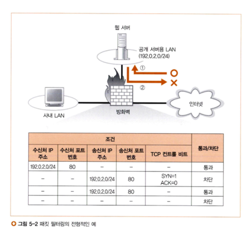

# story2. 방화벽의 원리와 동작

> story1에서 설명했듯이 서버의 설치 장소와 관계 없이, 패킷이 서버에 도착하기 전 방화벽이 있는 것이 일반적이다.  

> 이 때 방화벽이 패킷을 선별하는 방법 중 `패킷 필터링형`에 초점을 맞춰 패킷의 탐험을 설명한다.

## 패킷 필터링형
네트워크에는 다양한 종류의 패킷이 많이 흐르기 때문에, 통과/차단시킬 패킷을 선별하는 것은 간단한 일이 아니다.  
> 그래서 고안된 다양한 방법 중 하나인 `패킷 필터링형`이 성능, 가격, 사용 편의성 등의 이유로 가장 많이 보급되었다.  
  
## 조건 설정 개념

> 패킷 필터링은 패킷 헤더의 제어 정보를 조사해 조건을 설정한다.  

- 자주 사용하는 헤더의 예시
  - `송신처 MAC 주소`, `송/수신처 IP 주소`, `프로토콜 번호`, `송/수신처 포트번호`, `TCP 컨트롤 비트`, `프래그먼트`
  - `송신처 IP 주소`는 패킷을 송신한 기기를 조건으로 설정하는 경우에 사용
  - `수신처 IP 주소`는 패킷이 갈 목적지를 조건으로 설정하는 경우에 사용
  - `프로토콜 번호`는 프로토콜 종류마다 번호가 할당되어 있어, 프로토콜의 종류를 조건으로 설정할 경우 사용
  - `송/수신처 포트 번호`는 서버측 송신 패킷의 경우 서버 프로그램을 판별할 때는 사용하지만, 클라이언트측 송신 패킷의 포트 번호를 조건으로 설정하는 경우는 거의 없다.
  - `TCP 컨트롤 비트`는 접속에 관한 제어에 사용
  - `프래그먼트` 패킷이 조각나누기로 분할 된 조각 중 두번째 이후임을 확인
> 헤더가 아니라, ICMP 메시지의 내용도 조건 설정에 사용한다. (예를 들면 ping 명령에 대한 응답)

## 조건 설정 예시

> 서버에서 다른 서버로 부정 소프트웨어의 감염을 막기 위해, 별도 허가 없이는 `웹 서버`에서 `인터넷` 측에 액세스하는 것을 금지한다. 이 때도 패킷 필터링의 조건을 설정한다.
- 수신처 IP 주소와 송신처 IP 주소로 시점과 종점을 판단 (엔드포인트?)
- `인터넷` -> `웹 서버` 방향의 패킷 필터링
  - 종점(수신처 IP 주소)이 `웹 서버`의 IP 주소에 일치하는 패킷을 통과시킨다는 조건을 설정
- `웹 서버` -> `인터넷` 방향 패킷 필터링
  - 종점(송신처 IP 주소)이 `웹 서버`의 IP 주소에 일치하는 패킷을 통과시킨다는 조건을 설정

### 포트 번호로 애플리케이션을 한정하기
위의 조건 설정 예시만으로는 모든 패킷이 `인터넷` - `웹 서버` 사이를 통과할 수 있어 위험하다.    
> 불필요한 패킷을 모두 차단하기 위해 애플리케이션을 한정하기 위해, TCP 헤더나 UDP 헤더에 기록된 포트 번호를 조건으로 추가한다.

### 컨트롤 비트로 접속 방향 판단
`웹 서버`에서 `인터넷` 측에 액세스하는 동작을 정지시킬 수 있어야 한다.  
그런데 TCP는 클라이언트-서버가 서로 통신을 하여 패킷의 흐름이 양방향이다. 

> 액세스 동작을 정지시키려면, 양방향의 패킷 흐름 중 액세스하는 방향을 판단해야 한다. 이 때 컨트롤 비트를 이용한다. 

- 컨트롤 비트의 SYN이 1이고 ACK가 0인 패킷은 최초의 패킷 뿐이다.
- 최초의 패킷을 차단하면, 상대로부터 돌아오는 패킷이 없으므로 TCP 접속 동작이 실패한다.
- 이 방식으로 액세스 동작을 정지시킬 수 있다.
- 위의 `그림 5-2`에서 두번째 행은, `웹 서버` -> `인터넷` 방향이면서 최초의 패킷인 경우 액세스 동작이므로 차단하고 있다.
- 결국 `웹 서버` -> `인터넷` 방향으로 액세스할 때의 모든 패킷은 패킷 필터링을 거친다.

> 이렇게 여러 가지 조건들을 조합하여 패킷 필터링을 한다. 하지만 항상 완벽하게 차단/통과시킬 수 있는 것은 아니다.
- DNS 서버에 대한 액세스는 UDP로 이루어진다.
  - UDP의 경우 방향이 없기 때문에 위와 같은 판단이 불가능하다.
  - 위험을 감수하거나 비효율적이더라도 모든 패킷을 통과시키거나 차단해야 한다. 

### 사내 LAN에서 공개 서버용 LAN으로 조건 설정

`사내 LAN` - `공개 서버용 LAN` 사이의 패킷에도 조건 설정이 필요하다.  
> 이 때, 서로 다른 조건이 서로 악영향을 끼치지 않도록 주의해야 한다.
- 예시 상황
  - `사내 LAN` -> `공개 서버용 LAN` 액세스를 위해 수신처 IP 주소가 `공개 서버용 LAN`인 패킷을 모두 통과시킴
  - 송신처 IP 주소를 조건으로 설정하지 않아서, `인터넷` 측에서 흘러온 패킷이 모두 유입됨
  - `공개 서버용 LAN`의 서버가 전부 위험해짐

### 주소 변환과 사내 LAN에 대한 외부 액세스 

> 패킷 필터링형 방화벽은 주소 변환의 기능도 가지고 있으므로, 사내 LAN에 대한 외부 액세스 금지를 위한 조건 설정은 할 필요가 없다.

- `인터넷`의 라우터는 프라이빗 주소로 갈 패킷을 중계하지 않고 버린다.
- 따라서 `인터넷` - `사내 LAN`을 오가는 패킷은 주소 변환이 필요하다.
  - 방화벽은 패킷의 시점과 종점을 조건으로, 주소 변환이 필요한 경우에만 변환을 하도록 설정해줘야 한다.

## 방화벽과 라우터

> `패킷 필터링`이라는 구조는 특별한 것이 아니고, 라우터의 패킷 중계 기능 중 부가 기능이라고 생각하는 것이 좋다.

- 방화벽의 통과, 차단은 특별한 게 아니다.
  - 방화벽은 차단 대상이 된 패킷을 버린 뒤, 버린 기록을 남긴다. (부정 침입 대책을 위해)
  - 통과 판정을 내린 후에는, 라우터의 동작과 똑같이 패킷을 중계한다.
- 하지만 판정 조건이 복잡해질 수 있고, 기록을 남기는 것도 부담스러운 작업이기에 별도의 하드웨어/소프트웨어를 쓰는 것이다.
  - 버린 패킷의 기록이 필요하지 않으면, 패킷 필터링 기능을 가진 라우터를 방화벽으로 쓸 수도 있다.

## 방화벽으로 막을 수 없는 공격
> 방화벽은 시점과 종점만 조사하기 때문에 그 외의 내용이 위험한 패킷을 전부 판단할 수는 없다.
- 예를 들면 방화벽으로는, 해당 패킷이 서버를 다운시킬 데이터를 가졌는지 알지 못한다.
- 이에 대한 대처법
  1. 보안 구멍이 되는 웹 서버 소프트웨어의 버그를를 고쳐서 새로운 버전으로 갱신하는 것
  2. 패킷의 내용을 조사하고 차단할 수 있는 별도의 장치나 소프트웨어를 두는 것
