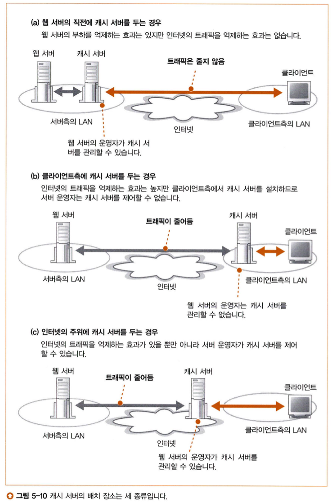

# story5. 콘텐츠 배포 서비스

## 콘텐츠 배포 서비스 (CDS, Content Delivery Service)
인터넷에 다수의 캐시 서버를 설치하고, 이것을 웹 서버 운영자에게 대출하는 서비스  
- 이 서비스를 제공하는 사업자를 CDSP(Content Delivery Service Provider)라 부른다.
- CDSP는 프로바이더와 계약하여 그곳에 다수의 캐시 서버를 설치한다.

## 콘텐츠 배포 서비스를 이용한 부하 분산
> **콘텐츠 배포 서비스를 왜 쓸까?**  
> 캐시 서버를 서버 측에 두는 경우와 클라이언트 측에 두는 경우는 각각 장단점이 있다. 하지만 아래 **3번 방법**처럼 프로바이더와 계약하여 웹 서버 운영자가 제어할 수 있는 캐시 서버를 클라이언트 측의 프로바이더에 두면, **양쪽의 좋은 점을 취할 수 있다.** 이 방법을 콘텐츠 배포 서비스를 통해 쉽게 적용할 수 있다.
### 캐시 서버의 배치 장소에 따른 비교
1. 서버 측의 LAN (웹 서버 직전)
   - 장점: 웹 서버의 부하를 경감
   - 단점: 인터넷을 흐르는 트래픽은 억제할 수 없다.
2. 클라이언트 측의 LAN
   - 장점: 인터넷의 트래픽 억제 (인터넷 혼잡에 대해 캐시 서버는 영향을 받지 않는다)
   - 단점: 웹서버 운영자가 캐시 서버를 제어할 수 없고, 클라이언트 측에 캐시 서버가 있다고 단정할 수 없다.
3. 인터넷 주위 (클라이언트 측의 프로바이더)
   - 사용자로부터 가까운 장소에 캐시 서버를 설치하면서(인터넷 트래픽 억제), 이를 웹 서버 운영자가 제어할 수 있다.

> 하지만 인터넷에 공개하는 서버는 인터넷의 어디에서 액세스하는지 모르는데, 그러면 프로바이더의 모든 POP(Point Of Presence, 제공자의 네트워크 내에 있는 하나 혹은 그 이상의 라우터 그룹)에 캐시 서버를 설치해야 한다.  
> 이 문제를 해결하기 위해 **프로바이더에 중점을 두면**, 캐시 서버의 수를 줄일 수 있다.

### 콘텐츠 배포 서비스 사용의 이점
> 웹 서버 운영자가 스스로 프로바이더와 계약하여 캐시 서버를 설치하는 것은 비용 면, 노력 면에서 쉽지 않다. 그래서 콘텐츠 배포 서비스를 이용하는 것이다.

- 웹 서버 운영자는 CDSP와 계약한다.
- CDSP는 설치한 캐시 서버와 웹 서버를 연대시킨다. -> 클라이언트가 웹 서버에 액세스할 때 CDSP의 캐시 서버에 액세스한다.
- CDSP가 설치한 캐시 서버는 다수의 웹 서버 운영자가 공동으로 이용할 수 있다. -> 한 회사 당 비용 절감 가능

## 가장 가까운 캐시 서버에 액세스하기
> 콘텐츠 배포 서비스를 사용하는 경우, 다수의 캐시 서버를 이용하기에 **가장 가까운 캐시 서버를 찾아내고 클라이언트의 액세스를 위해 중재**하는 구조가 필요하다.
- 리퀘스트 메시지가 캐시 서버에 도착하는(것 같은) 중간 과정이 필요하다.
- 또, 가장 가까운 캐시 서버로 보내야한다.

방법으로는 몇 가지가 있다.  
### DNS 서버에서 설정하기
- DNS 서버의 동작 방식과 라우터의 경로표를 이용한다.
- 가장 가까운 캐시 서버에 액세스하기 위해서는, DNS 서버의 동작 방식을 그대로 사용할 수는 없다.
  - DNS 서버는 복수의 IP 주소에 대해 라운드 로빈으로 회답한다. 이 경우 캐시 서버의 위치 관계를 전혀 고려하지 않기 때문이다.
  - 따라서 거리를 판단하는 과정을 추가한다.
- **클라이언트와 캐시 서버의 거리를 판단하는 방법**
  1. 다수의 캐시 서버에 연결된 각각의 라우터에서 경로표를 입수하여 경로표들을 모두 `서버 측의 DNS 서버` 곁에 모은다.
  2. 이 경로표들을 사용해 `각 캐시 서버의 라우터 -> 클라이언트 측의 DNS 서버`까지의 경로 정보를 알 수 있다.
  3. 인터넷 내부의 경로 정보는 `프로바이더 X -> 프로바이더 Y -> 프로바이더 Z` 와 같은 형태로 경로가 기록되어 있어, 대략적인 거리를 알 수 있다.
  4. 모든 라우터에 대해 이를 조사하고 비교해 가장 가까운 라우터를 찾는다.

> 이 방법은 클라이언트 측의 DNS 서버를 기준으로 계산하므로 거리 계산의 정밀도는 높지 않다.
> 클라이언트가 항상 클라이언트 측의 DNS 서버와 같은 장소에 있는 것은 아니기 때문이다.

### 리피터용 서버로 액세스 대상 분배하기
- HTTP의 Location 헤더를 이용해 액세스 대상을 웹 서버에서 가장 가까운 캐시 서버로 리다이렉트한다.
  - "그 데이터는 이쪽의 서버에 있으므로 그쪽으로 다시 액세스하세요." 라는 의미
- **가장 가까운 캐시 서버로 리다이렉트하는 방법**
  1. `리다이렉트용 서버`를 웹 서버 측의 DNS 서버에 등록해둔다.
  2. 클라이언트는 이곳으로 HTTP 리퀘스트 메시지를 보낸다.
  3. `리다이렉트용 서버`는 DNS 서버와 같이 라우터에서 모은 경로 정보를 가지고 있다. 이를 이용해 가장 가까운 캐시 서버를 찾는다.
  4. `리다이렉트용 서버`는 Location 헤더에 리다이렉트 대상을 담아 응답을 돌려보낸다.
  5. 클라이언트는 캐시 서버에 다시 액세스한다.

> 이 방법은 HTTP 메시지의 대화가 증가하므로, 오버헤드가 많다.  
> 하지만 리다이렉트는 클라이언트가 보내는 HTTP 메시지의 송신처 IP 주소를 바탕으로 거리를 판단하므로 정밀도가 높다.

### 경로 정보를 사용하지 않고 거리를 계산하는 방법
- 패킷의 왕복시간을 통해 거리를 계산
  - 리다이렉트용 서버가 이런 계산을 하고 최적의 캐시 서버에 액세스하도록 스크립트 프로그램을 내장한 페이지를 반송한다.

## 캐시 내용의 갱신 방법, 성능의 차이
> 캐시의 내용을 갱신하는 방법은 **캐시 서버의 효율**을 좌우하는 요소 중 하나이다. 

### 캐시 데이터를 항상 최신으로 유지하기
- 캐시는 한 번 액세스한 데이터에 대해, 이후의 추가 액세스 동작의 효율을 높이는 데 있다.
- 그러나 캐시에 데이터가 있는 경우에도 늘 웹 서버에 갱신된 내용의 유무(콘텐츠에 변경이 없는지)를 확인해야 하므로, 응답 시간이 악화된다. (성능적 이점 감소)
- 이 점을 개선하기 위해, 웹 서버에서 데이터 갱신을 할 때마다 즉시 캐시 서버에 반영해야 한다.
  - 캐시 데이터가 항상 최신 상태이면, 웹 서버의 데이터 갱신 여부를 확인할 필요 없다.
- 주의점
  - 동적 페이지를 만드는 경우, 매번 페이지의 내용이 달라지는 부분은 제외하고 변하지 않는 부분만 캐시에 저장해야 한다.

> **Chapter 05 끝**  
> 방화벽이나 프록시 서버, 캐시 서버 등 다양한 서버를 통과하여 리퀘스트가 웹 서버에 도착한다.